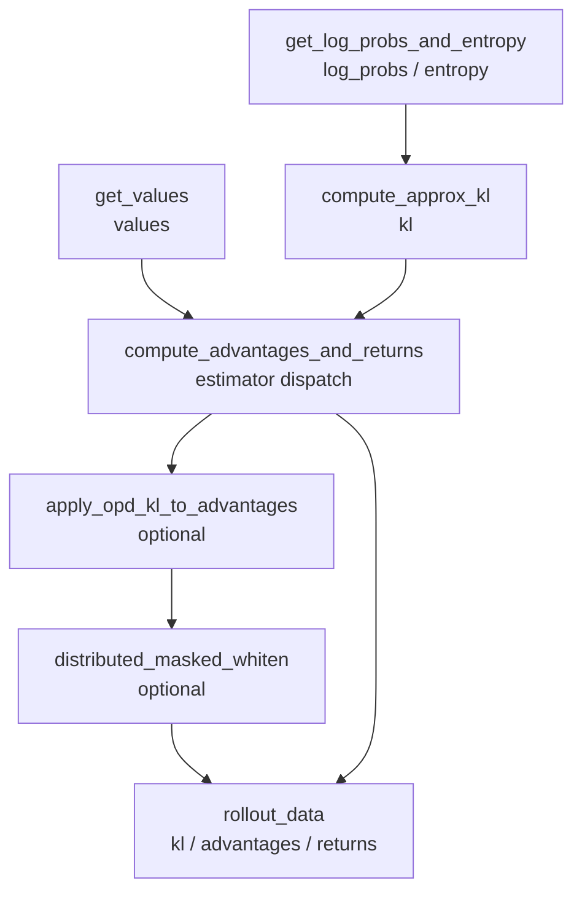

# Loss · Advantages · 源码走读

> 走读顺序：`get_log_probs_and_entropy` → `get_values` → `compute_advantages_and_returns` → `apply_opd_kl_to_advantages`。主文件是 `slime/backends/megatron_utils/loss.py`，数学与分布式辅助函数在 `slime/utils/ppo_utils.py`、`slime/utils/distributed_utils.py` 与 `slime/backends/megatron_utils/cp_utils.py`。

---

## 1. Logprob 与 Entropy

### 1.1 forward-step 的返回契约

**问题与约束：** Megatron 的 `forward_step` 需要一个可返回 loss tensor 的函数接口，但 Slime 在 rollout 评估阶段真正需要的是每个 response token 的 logprob 和可选 entropy。

**设计选择：** 函数签名保留 `non_loss_data`、`with_entropy`、packed batch 元信息和 top-p replay 参数，最终用空 tensor 占位 loss，把结构化结果放进字典。

**Explain：** 这里的主产物不是标量 loss，而是 `res["log_probs"]` 与可选的 `res["entropy"]`。`unconcat_tokens`、`total_lengths`、`response_lengths` 让函数能从 packed logits 还原 sample 边界。

**Code：**

来源：slime/backends/megatron_utils/loss.py L470-L481

```python
def get_log_probs_and_entropy(
    logits: torch.Tensor,
    *,
    args: Namespace,
    unconcat_tokens: list[torch.Tensor],
    total_lengths: list[int],
    response_lengths: list[int],
    with_entropy: bool = False,
    non_loss_data: bool = True,
    top_p_token_ids: list[list[int]] | None = None,
    top_p_token_offsets: list[list[int]] | None = None,
) -> dict[str, list[torch.Tensor]]:
```

**代码逻辑：** 参数把 packed logits、每条样本的原始 token、长度和 rollout top-p 记录一起交给同一个函数，返回类型声明为每个 key 对应一组 sample tensor。

**为什么这样写：** 后续 advantage 计算按 sample 处理，因此这里不把 `[T,V]` 的大 tensor 原样传下去，而是在同一处完成 response 对齐和字典化输出。

**不变量与失败模式：** `total_lengths`、`response_lengths` 和 `unconcat_tokens` 的顺序必须一致；一旦上游打乱样本顺序，logprob 会与 reward/value 错位。

**Comment：** 读这段时要把它看成“forward-only 特征提取器”，不是训练 loss 本体。

### 1.2 logits 形状、温度和 entropy 梯度

**问题与约束：** rollout engine 可能使用非 1 的采样温度；训练端重算 logprob 时必须复现同一分布，同时不能为不用进 loss 的 entropy 保存多余 backward 激活。

**设计选择：** 先断言 `float32` 和 batch 维为 1，再 squeeze 成 `[T,V]`；按 `rollout_temperature` 缩放；只有 `with_entropy` 且 `entropy_coef != 0` 时保留 entropy 梯度。

**Explain：** `with_entropy_grad` 是显存开关，不是指标开关。即使 entropy 不参与反向传播，也仍可计算出来用于记录。

**Code：**

来源：slime/backends/megatron_utils/loss.py L491-L508

```python
assert non_loss_data
assert logits.dtype == torch.float32, f"{logits.dtype}"
assert len(logits.shape) == 3, f"{logits.shape}"
assert logits.size(0) == 1, f"{logits.shape}"
logits = logits.squeeze(0)

rollout_temperature = getattr(args, "rollout_temperature", 1.0)
if rollout_temperature != 1.0:
    logits = logits / rollout_temperature
logits = logits.contiguous()
T = logits.size(0)
tp_group = mpu.get_tensor_model_parallel_group()
chunk_size = args.log_probs_chunk_size
with_entropy_grad = with_entropy and getattr(args, "entropy_coef", 0.0) != 0
```

**代码逻辑：** 形状检查先把非法输入挡住；温度缩放发生在所有 logprob/entropy 计算之前；TP group 与 chunk size 被传给后续 vocab-parallel logprob helper。

**为什么这样写：** 如果温度只在 rollout 端生效，训练端 KL 和 policy ratio 会比较两个不同分布；如果 entropy 梯度总是开启，`entropy_coef=0` 时会浪费显存。

**不变量与失败模式：** `logits` 必须是 `[1,T,V_local]` 且 `float32`；若模型输出已经被 squeeze 或 dtype 不是 float32，会触发断言而不是静默算错。

**Comment：** 这段把“与 rollout 分布一致”和“节省训练显存”两个目标放在同一个入口处处理。

### 1.3 构造 next-token target

**问题与约束：** logits 的第 `t` 行预测 token 的第 `t+1` 个位置；packed 序列和 context parallel 布局会让这个偏移不再是简单的全局切片。

**设计选择：** 用 `_build_shifted_tokens` 独立生成与本 rank logits 行数对齐的 target tensor，并为 zigzag CP、allgather CP、CP=1 分别走不同路径。

**Explain：** CP=1 和 allgather CP 先按全局 packed 序列写入 `tokens[1:total_length]`；zigzag CP 则依赖 `get_logits_and_tokens_offset_with_cp` 拿到每个 rank 的两段局部 offset。

**Code：**

来源：slime/backends/megatron_utils/loss.py L230-L280

```python
def _build_shifted_tokens(T, device, unconcat_tokens, total_lengths, response_lengths, allgather_cp):
    cp_size = mpu.get_context_parallel_world_size()
    if cp_size > 1 and not allgather_cp:
        full_tokens = torch.zeros(T, dtype=torch.long, device=device)
        end = 0
        for tokens, total_length, response_length in zip(unconcat_tokens, total_lengths, response_lengths, strict=False):
            chunk_size_cp, chunks_offset, logits_offset, tokens_offset = get_logits_and_tokens_offset_with_cp(
                total_length, response_length
            )
            for half, base in ((0, end), (1, end + chunk_size_cp)):
                lo = logits_offset[half][0] - chunks_offset[half][0]
                hi = logits_offset[half][1] - chunks_offset[half][0]
                full_tokens[base + lo : base + hi] = tokens[tokens_offset[half][0] : tokens_offset[half][1]]
            end += 2 * chunk_size_cp
        return full_tokens

    T_global = sum(total_lengths) if allgather_cp else T
    full_tokens = torch.zeros(T_global, dtype=torch.long, device=device)
    offset = 0
    for tokens, total_length in zip(unconcat_tokens, total_lengths, strict=False):
        full_tokens[offset : offset + total_length - 1] = tokens[1:total_length]
        offset += total_length
```

**代码逻辑：** zigzag CP 直接按两段 chunk 填本地 tensor；allgather CP 先构建全局 shifted tokens，再按 `cp_rank * T` 截出本 rank 连续片段。

**为什么这样写：** target 与 logits 的行对齐是 logprob 的硬前提，把它拆成 helper 能让 top-p mask、logprob 计算和 per-sample extraction 都共享同一套长度语义。

**不变量与失败模式：** `tokens_offset` 指向的是 token 位置，`logits_offset` 指向的是预测这些 token 的 logits 位置；少掉 `+1` 或 `-1` 会形成全段错位。

**Comment：** 这一段是整篇最容易出 off-by-one 的地方，重点看 `total_length - 1` 和 `prompt_length - 1` 这些边界。

### 1.4 top-p replay 参数门禁

**问题与约束：** 当 rollout 使用 nucleus sampling 时，训练端若用完整 vocab 重算 logprob，会得到和采样时不同的归一化分布。

**设计选择：** `rollout_top_p == 1.0` 时不传额外参数；否则强制 batch 同时携带 `rollout_top_p_token_ids` 和 `rollout_top_p_token_offsets`。

**Explain：** 这不是可选指标，而是分布对齐所需的 replay 数据。缺任一字段都直接抛错，避免静默退回完整 vocab。

**Code：**

来源：slime/backends/megatron_utils/loss.py L40-L51

```python
def get_rollout_top_p_logprob_kwargs(args: Namespace, batch: dict[str, Any]) -> dict[str, Any]:
    if args.rollout_top_p == 1.0:
        return {}

    top_p_token_ids = batch.get("rollout_top_p_token_ids")
    top_p_token_offsets = batch.get("rollout_top_p_token_offsets")
    if top_p_token_ids is None or top_p_token_offsets is None:
        raise ValueError("rollout_top_p != 1.0 requires rollout_top_p_token_ids and rollout_top_p_token_offsets.")
    return {
        "top_p_token_ids": top_p_token_ids,
        "top_p_token_offsets": top_p_token_offsets,
    }
```

**代码逻辑：** 参数函数只做门禁和字段转发，不在这里构造 mask；真正的 `[T,V_local]` mask 构造留给有 device、TP rank 和 CP 布局信息的 logprob 函数。

**为什么这样写：** batch 数据通常来自 rollout 侧，mask 的形状则依赖训练端并行切分；把二者分开能避免在 CPU batch 阶段绑定 GPU 布局。

**不变量与失败模式：** `ids` 和 `offsets` 必须按 response token ragged 编码；如果 offset 长度与 response 长度不一致，后续 mask 只能覆盖部分行。

**Comment：** 这段体现的是“top-p 不是采样细节，而是 logprob 重放契约”。

### 1.5 top-p keep mask 对齐本地 vocab 与 CP 行

**问题与约束：** top-p nucleus 是全局 vocab id 的 ragged 列表，而训练 logits 是 TP 切分后的本地 vocab，并且行布局还可能是 CP=1、allgather CP 或 zigzag CP。

**设计选择：** `_build_topp_keep_mask` 先把 ragged payload 规整成 Python list，再根据 TP rank 算出本地 vocab 区间；每个 response 行只保留本地 nucleus token。

**Explain：** mask 默认全 True，只有有 replay 数据的 response 行会先清空再写回 nucleus 内 token。Entropy 不用这个 mask，mask 只传给 logprob 计算。

**Code：**

来源：slime/backends/megatron_utils/loss.py L283-L386

```python
def _fill_topp_mask_rows(keep, ids, offsets, response_start, local_start, length, vocab_start, vocab_end):
    end = min(response_start + length, max(len(offsets) - 1, 0))
    for response_idx in range(response_start, end):
        local_ids = [
            token_id - vocab_start
            for token_id in ids[offsets[response_idx] : offsets[response_idx + 1]]
            if vocab_start <= token_id < vocab_end
        ]
        row = local_start + response_idx - response_start
        keep[row].fill_(False)
        if local_ids:
            keep[row, torch.tensor(local_ids, device=keep.device, dtype=torch.long)] = True

def _build_topp_keep_mask(T, vocab_local, device, top_p_token_ids, top_p_token_offsets, total_lengths, response_lengths, allgather_cp):
    cp_size = mpu.get_context_parallel_world_size()
    tp_rank = mpu.get_tensor_model_parallel_rank()
    vocab_start = tp_rank * vocab_local
    vocab_end = vocab_start + vocab_local
    keep = torch.ones((T, vocab_local), dtype=torch.bool, device=device)
```

**代码逻辑：** CP zigzag 路径用 `tokens_offset` 推出 response-space 起点；allgather CP 路径用全局 logits chunk 与 response logits 区间求交；CP=1 路径直接从 `start - 1` 开始填 response 行。

**为什么这样写：** 同一条 top-p replay 数据必须同时满足 TP vocab 切分和 CP 序列切分；把 mask 落在本地 logits 形状上，可以直接交给 vocab-parallel logprob helper。

**不变量与失败模式：** mask 行数必须等于本 rank 的 `T`，列数必须等于 `V_local`；如果某行 nucleus 在本 TP rank 上没有 token，该行会保持全 False，要求后续并行 softmax 能正确跨 TP 聚合。

**Comment：** 这段解释了为什么 top-p replay 不能只在采样侧记录一个概率值，而要保存 token id 与 offset。

### 1.6 一次性计算 logprob 与 entropy

**问题与约束：** 如果按 sample 循环对 `[R,V]` 片段逐个算 logprob，backward 会重复穿过多个小图；但完整 `[T,V]` 可能太长，需要 chunk 控制峰值显存。

**设计选择：** `calculate_log_probs_and_entropy` 对完整 logits 做可选 chunk，然后每个 chunk 调底层 `_calculate_log_probs_and_entropy_chunk`，最后拼回 `[T]`。

**Explain：** `log_prob_keep_mask` 与 logits 同步 chunk，只影响 logprob；`with_entropy_grad` 继续向下传递，决定 entropy 分支是否保留梯度。

**Code：**

来源：slime/utils/ppo_utils.py L809-L860

```python
def calculate_log_probs_and_entropy(
    logits,
    tokens,
    tp_group,
    with_entropy: bool = False,
    chunk_size: int = -1,
    log_prob_keep_mask=None,
    with_entropy_grad: bool = True,
):
    logits = logits.contiguous()
    entropy = None
    if logits.size(0) != 0:
        if chunk_size > 0:
            num_chunks = (logits.size(0) - 1) // chunk_size + 1
            logits_chunks = logits.chunk(num_chunks, dim=0)
            tokens_chunks = tokens.chunk(num_chunks, dim=0)
            mask_chunks = (
                log_prob_keep_mask.chunk(num_chunks, dim=0) if log_prob_keep_mask is not None else [None] * num_chunks
            )
            log_probs = []
            entropy_chunks = []
            for tokens_chunk, logits_chunk, mask_chunk in zip(tokens_chunks, logits_chunks, mask_chunks, strict=True):
                log_prob, entropy_chunk = _calculate_log_probs_and_entropy_chunk(...)
                log_probs.append(log_prob)
                if entropy_chunk is not None:
                    entropy_chunks.append(entropy_chunk)
            log_prob = torch.cat(log_probs, dim=0)
```

**代码逻辑：** 空 logits 返回空 tensor；非空时按 `chunk_size` 切 logits、tokens 和 mask，逐段计算后拼接；不开 chunk 时直接算整段。

**为什么这样写：** 计算粒度以 packed 序列为单位，可以减少 Python 循环和 autograd 图碎片；chunk 只作为显存阀门，不改变输出语义。

**不变量与失败模式：** logits、tokens、mask 的第 0 维必须一致；chunk 时用 `strict=True`，长度不一致会立即报错。

**Comment：** `loss.py` 负责对齐样本与 CP 布局，`ppo_utils.py` 负责实际 vocab-parallel logprob 数学。

### 1.7 response 切片回 sample

**问题与约束：** logprob helper 输出的是本 rank 的连续或 zigzag `[T]` 结果，而 advantage 需要每条 sample 的 response token 序列。

**设计选择：** `_extract_per_sample` 按 CP 布局分三套切法：zigzag CP 拼两段，allgather CP 取全局交集，CP=1 用 `start - 1 : end - 1`。

**Explain：** 切片目标是 logits 行，不是 token 行，所以 response token `[prompt, total)` 对应 logits `[prompt-1, total-1)`。

**Code：**

来源：slime/backends/megatron_utils/loss.py L389-L465

```python
def _extract_per_sample(log_prob_full, entropy_full, total_lengths, response_lengths, allgather_cp):
    cp_size = mpu.get_context_parallel_world_size()
    log_probs_list = []
    entropy_list = []

    if cp_size > 1 and not allgather_cp:
        pos = 0
        for total_length, response_length in zip(total_lengths, response_lengths, strict=False):
            chunk_size_cp, chunks_offset, logits_offset, _tokens_offset = get_logits_and_tokens_offset_with_cp(
                total_length, response_length
            )
            lp = torch.cat([...], dim=0)
            log_probs_list.append(lp)
            pos += 2 * chunk_size_cp
    elif allgather_cp:
        ...
    else:
        offset = 0
        for total_length, response_length in zip(total_lengths, response_lengths, strict=False):
            end = offset + total_length
            start = end - response_length
            log_probs_list.append(log_prob_full[start - 1 : end - 1])
```

**代码逻辑：** zigzag 路径从每条样本的两个 CP chunk 中取有效 logits 段并拼接；allgather 路径按本 rank 连续全局区间求交；普通路径用 packed offset 顺序推进。

**为什么这样写：** downstream 的 `rollout_data` 约定是 list-of-sample tensors，而不是 packed tensor；把拆分集中在这里能让后续 KL、advantage、loss mask 使用同一种 sample 视图。

**不变量与失败模式：** 切出的每个 tensor 长度应等于本 rank 负责的 response token 数；CP 情况下不能假设每个 rank 都有同一条样本的非空片段。

**Comment：** 这一步把“高吞吐 packed 计算”转回“按样本计算奖励和优势”的数据形态。

### 1.8 allgather CP 重分布到 zigzag 布局

**问题与约束：** allgather CP 计算阶段每个 rank 拿的是连续全局序列片段，而后续 loss 侧通常按 zigzag ring-attn 的本地 response 片段消费 logprob、entropy 或 value。

**设计选择：** `_allgather_cp_redistribute` 先把每个 rank 的局部贡献 pad 到完整 response 长度，通过 differentiable all-reduce 重建全 response，再用 `slice_log_prob_with_cp` 切回 zigzag 片段。

**Explain：** 这不是普通 gather，而是用 `dist.nn.all_reduce` 保持梯度路径；函数就地修改 `res` 字典里的每个 key。

**Code：**

来源：slime/backends/megatron_utils/loss.py L151-L227

```python
def _allgather_cp_redistribute(res, *, logits_local_len, total_lengths, response_lengths) -> None:
    cp_group = mpu.get_context_parallel_group()
    cp_rank = mpu.get_context_parallel_rank()
    chunk_start = cp_rank * logits_local_len
    chunk_end = chunk_start + logits_local_len

    for key, values in res.items():
        if all(v is None for v in values):
            continue
        full_resps = []
        seq_start = 0
        for value, total_length, response_length in zip(values, total_lengths, response_lengths, strict=False):
            prompt_length = total_length - response_length
            logit_global_start = seq_start + prompt_length - 1
            logit_global_end = seq_start + total_length - 1
            s = max(logit_global_start, chunk_start)
            e = min(logit_global_end, chunk_end)
            full_resp = F.pad(value, (resp_start, response_length - resp_end)) if e > s else torch.zeros(...)
            full_resps.append(full_resp)
            seq_start += total_length

        all_cat = torch.cat(full_resps, dim=0)
        all_cat = dist.nn.all_reduce(all_cat, group=cp_group)
        res[key] = [slice_log_prob_with_cp(full_resp, total_length, response_length) for ...]
```

**代码逻辑：** 每个 rank 先把自己覆盖的 response 子区间放进完整长度 tensor，未覆盖部分填 0；all-reduce 后每条样本恢复完整 response，再切成当前 rank 的 zigzag 本地片段。

**为什么这样写：** 训练后续算 loss 时要和 ring-attn CP 的本地布局一致；提前统一布局，避免每个 downstream loss 分支重复处理 allgather CP。

**不变量与失败模式：** 不同 rank 对同一 response 的非零区间必须互不重叠且合起来覆盖完整 response；如果局部区间计算错，all-reduce 会把错误位置相加或留下 0。

**Comment：** 这是 allgather CP 与常规 zigzag CP 之间的桥，logprob、entropy、value 都复用这一段。

## 2. Value 抽取

### 2.1 response iterator 的通用切片

**问题与约束：** policy logits 和 value head 输出都需要按 response 对齐；前者通常是 `[1,T,V]`，后者是 `[1,T,1]`，两者共享 packed/CP 边界。

**设计选择：** `get_responses` 作为通用 iterator，负责 squeeze batch、可选温度缩放，并按 CP 布局产出 `(logits_chunk, tokens_chunk)`。

**Explain：** `apply_temperature` 是关键参数：policy logprob 路径需要温度缩放，value 路径必须关闭。

**Code：**

来源：slime/backends/megatron_utils/loss.py L54-L149

```python
def get_responses(logits, *, args, unconcat_tokens, total_lengths, response_lengths, apply_temperature=True):
    assert logits.dtype == torch.float32, f"{logits.dtype}"
    assert len(logits.shape) == 3, f"{logits.shape}"
    assert logits.size(0) == 1, f"{logits.shape}"
    logits = logits.squeeze(0)

    if apply_temperature and args.rollout_temperature != 1.0:
        logits = logits.div(args.rollout_temperature)

    cp_size = mpu.get_context_parallel_world_size()
    end = 0
    seq_start = 0
    for tokens, total_length, response_length in zip(unconcat_tokens, total_lengths, response_lengths, strict=False):
        if cp_size == 1:
            end += total_length
            start = end - response_length
            logits_chunk = logits[start - 1 : end - 1]
            tokens_chunk = tokens[-response_length:]
        elif args.allgather_cp:
            ...
        else:
            ...
        yield logits_chunk, tokens_chunk
```

**代码逻辑：** 函数在每条样本上产出 response 对齐的 logits 和 token；CP=1 直接切片，allgather CP 按连续全局 chunk 求交，zigzag CP 拼两段。

**为什么这样写：** value 和 policy 的 response 切片规则完全一致，差别只在是否温度缩放和最后一维大小；复用 iterator 能减少两套切片逻辑分叉。

**不变量与失败模式：** 产出的 `logits_chunk.size(0)` 必须等于 `tokens_chunk.size(0)`；源码在 allgather 和 zigzag 路径都有断言保护。

**Comment：** `get_log_probs_and_entropy` 后来改成完整 `[T,V]` 一次性计算，但 value 路径仍然适合复用这个 iterator。

### 2.2 value head 输出写入 values

**问题与约束：** Critic 只需要 response token 上的标量 value；它不应继承 policy logprob 的温度缩放，也不需要 entropy。

**设计选择：** `get_values` 调 `get_responses(..., apply_temperature=False)`，断言最后一维为 1，再 squeeze 成 `[R]`，并在 allgather CP 下复用重分布逻辑。

**Explain：** 函数签名保留 `with_entropy` 和 `non_loss_data` 是为了能接入同一套 forward-step 调度，不代表 value 路径会使用这些参数。

**Code：**

来源：slime/backends/megatron_utils/loss.py L564-L617

```python
def get_values(logits, *, args, unconcat_tokens, total_lengths, response_lengths, with_entropy=False, non_loss_data=True):
    value_list = []
    for logits_chunk, _ in get_responses(
        logits,
        args=args,
        unconcat_tokens=unconcat_tokens,
        total_lengths=total_lengths,
        response_lengths=response_lengths,
        apply_temperature=False,
    ):
        assert logits_chunk.size(-1) == 1, f"{logits_chunk.shape}"
        value_list.append(logits_chunk.squeeze(-1))

    res = {"values": value_list}
    if args.allgather_cp:
        _allgather_cp_redistribute(res, logits_local_len=logits.size(1), total_lengths=total_lengths, response_lengths=response_lengths)
    return torch.empty((0,), device=logits.device), res
```

**代码逻辑：** 每个 sample 的 value chunk 被 squeeze 后放入 `res["values"]`；allgather CP 场景把连续布局转换成 zigzag 布局；最后同样返回空 tensor 与字典。

**为什么这样写：** Advantage 里的 PPO/GAE 需要 token 级 value 与 reward 对齐；统一输出 list-of-tensors，actor 和 critic 阶段可以通过 `rollout_data` 共享格式。

**不变量与失败模式：** value head 输出最后一维必须为 1；如果模型 head 配置错成 vocab logits 或多维 value，断言会提前暴露。

**Comment：** value 路径和 logprob 路径的共同点是 response 对齐，差异点是 value 没有采样分布语义。

## 3. KL 与 Advantage 分支

### 3.1 KL estimator 的数学入口

**问题与约束：** policy 与 reference 的偏离可以用多种近似 KL 估计；不同训练 recipe 可能需要 k1、k2、k3 或 low-variance KL。

**设计选择：** `compute_approx_kl` 只接收两个 logprob tensor 和 `kl_loss_type`，可选用 importance ratio 修正，并只在 `low_var_kl` 时 clamp。

**Explain：** 输入是已经按 sample response 对齐的 logprob；函数不关心 packed、CP 或 reward，只做逐 token KL 估计。

**Code：**

来源：slime/utils/ppo_utils.py L12-L51

```python
def compute_approx_kl(log_probs, log_probs_base, kl_loss_type, importance_ratio=None) -> torch.Tensor:
    log_ratio = log_probs.float() - log_probs_base.float()

    if kl_loss_type == "k1":
        kl = log_ratio
    elif kl_loss_type == "k2":
        kl = log_ratio**2 / 2.0
    elif kl_loss_type in ["k3", "low_var_kl"]:
        log_ratio = -log_ratio
        kl = log_ratio.exp() - 1 - log_ratio
    else:
        raise ValueError(f"Unknown kl_loss_type: {kl_loss_type}")

    if importance_ratio is not None:
        kl = importance_ratio * kl
    if kl_loss_type == "low_var_kl":
        kl = torch.clamp(kl, min=-10, max=10)
    return kl
```

**代码逻辑：** `log_ratio` 是 current-reference；k3/low-var 分支反号后用 `exp(x)-1-x`；未知类型直接报错。

**为什么这样写：** KL 估计形式是策略算法超参，不应散落在 advantage 主流程；集中在 helper 里也方便 policy loss 侧复用。

**不变量与失败模式：** 两个 logprob tensor 必须同形同 token 顺序；如果 ref logprob 缺失或长度不一致，调用处会在 list indexing 或 tensor 运算中失败。

**Comment：** 这段只生成 KL 张量，KL 何时乘系数、加到 reward 还是 loss，由外层 estimator 决定。

### 3.2 主流程输入抽取与 KL 写入

**问题与约束：** `rollout_data` 可能来自 actor、critic、reference、teacher 多个 forward；pipeline 非最后 stage 不应尝试计算 advantage。

**设计选择：** `compute_advantages_and_returns` 从 `rollout_data` 抽取所需字段，在非 pipeline last stage 直接返回；`kl_coef==0` 或无 logprob 时生成零 KL。

**Explain：** `args.use_rollout_logprobs` 决定使用 rollout 时记录的 logprob 还是训练端重算 logprob；无论哪种，最终都把 `kl` 写回 `rollout_data`。

**Code：**

来源：slime/backends/megatron_utils/loss.py L661-L713

```python
def compute_advantages_and_returns(args: Namespace, rollout_data: RolloutBatch) -> None:
    rollout_log_probs = rollout_data.get("rollout_log_probs")
    log_probs = rollout_log_probs if args.use_rollout_logprobs else rollout_data.get("log_probs")
    ref_log_probs = rollout_data.get("ref_log_probs")
    rewards = rollout_data.get("rewards")
    values = rollout_data.get("values")
    response_lengths = rollout_data.get("response_lengths")
    loss_masks = rollout_data.get("loss_masks")
    total_lengths = rollout_data.get("total_lengths")

    if not mpu.is_pipeline_last_stage():
        return

    if args.kl_coef == 0 or not log_probs:
        xs = log_probs or rollout_log_probs or values
        kl = [torch.zeros_like(x, dtype=torch.float32, device=x.device) for x in xs]
    else:
        kl = [compute_approx_kl(log_probs[i], ref_log_probs[i], kl_loss_type=args.kl_loss_type) for i in range(len(log_probs))]
    rollout_data["kl"] = kl
```

**代码逻辑：** 主流程先选择 student logprob 来源，再计算或伪造零 KL；KL list 的长度与所选 `xs` 一致，供后续 estimator 分支消费。

**为什么这样写：** `kl_coef==0` 时无需 reference forward；pipeline 中间 stage 没有完整 logits/value，也不能产生完整 advantage。

**不变量与失败模式：** 若 `kl_coef>0` 且 `log_probs` 存在，`ref_log_probs` 必须存在且逐样本长度一致；若 `kl_coef==0` 且 `log_probs/rollout_log_probs/values` 都为空，`xs` 会变成 `None` 并导致错误。

**Comment：** 这一段是所有 estimator 的共同前置，后面分支只关心已经对齐好的 `kl`、`rewards`、`values` 和 mask。

### 3.3 自定义 advantage hook

**问题与约束：** 内置 estimator 不能覆盖所有实验需求，但主流程仍要复用前置 KL 计算和后置 OPD/normalization。

**设计选择：** 如果配置了 `custom_advantage_function_path`，动态加载函数，让它直接改写 `rollout_data` 中的 `advantages` 和 `returns`。

**Explain：** hook 的边界是在 KL 之后、OPD 和 normalization 之前；自定义函数必须遵守同样的 list-of-token-tensors 输出格式。

**Code：**

来源：slime/backends/megatron_utils/loss.py L715-L718

```python
if args.custom_advantage_function_path is not None:
    custom_adv_fn = load_function(args.custom_advantage_function_path)
    custom_adv_fn(args, rollout_data)
    advantages, returns = rollout_data["advantages"], rollout_data["returns"]
```

**代码逻辑：** 动态函数拿到完整 `args` 和 `rollout_data`；返回值不通过函数返回，而是从字典约定键读取。

**为什么这样写：** 自定义 estimator 常需要 rewards、KL、mask、长度等多个字段，传整个 `rollout_data` 比扩展函数签名更稳定。

**不变量与失败模式：** hook 必须写入 `advantages` 和 `returns`；缺任一键会在读取时失败，长度错则会在 OPD 或 normalization 阶段暴露。

**Comment：** 这提供实验扩展点，但不会绕过共同的后处理链。

### 3.4 GRPO / GSPO / CISPO 主分支

**问题与约束：** GRPO 类方法不使用 critic value 做 GAE，初始 signal 来自每条 response 的标量 reward。

**设计选择：** 将 `rewards` 转成与 KL 同 device 的 tensor，调用 `get_grpo_returns` 广播到每个 token，并把 returns 浅拷贝为 advantages。

**Explain：** 该分支不在这里把 KL 扣进 reward；KL 已单独写入 `rollout_data["kl"]`，policy loss 侧可以按算法配置处理。

**Code：**

来源：slime/backends/megatron_utils/loss.py L720-L724

```python
elif args.advantage_estimator in ["grpo", "gspo", "cispo"]:
    rewards = torch.tensor(rewards, dtype=torch.float32, device=kl[0].device)
    returns = get_grpo_returns(rewards, kl)
    advantages = [r for r in returns]
```

**代码逻辑：** 每个 sample 的 scalar reward 被转成 GPU tensor；`kl` 在这里只用于提供每条 response 的形状。

**为什么这样写：** GRPO 类分支需要 token 级 advantage 以复用 actor loss 的逐 token计算，但它的 reward 本质仍是序列级。

**不变量与失败模式：** `kl` 不能为空，且每个 `kl[i]` 长度就是该样本本地 response 长度；否则 reward 广播形状会错误。

**Comment：** 这段是最薄的一层算法分派，实际广播细节在 `ppo_utils.py`。

### 3.5 GRPO return 广播

**问题与约束：** 序列级 reward 要进入 token 级 policy loss，需要扩展成与每条 response token 数一致的 tensor。

**设计选择：** `get_grpo_returns` 用 `torch.ones_like(kl[i]) * rewards[i]` 直接按 KL tensor 的形状广播。

**Explain：** 这里使用 KL tensor 只为了取 shape、dtype/device 语境；返回值本身不包含 KL 惩罚。

**Code：**

来源：slime/utils/ppo_utils.py L361-L368

```python
def get_grpo_returns(rewards: torch.Tensor, kl: list[torch.Tensor]):
    returns = []
    for i in range(len(rewards)):
        returns.append(torch.ones_like(kl[i]) * rewards[i])
    return returns
```

**代码逻辑：** 遍历 batch 中每条样本，创建与该样本 KL 同形的全 1 tensor，再乘以该样本 reward。

**为什么这样写：** response 长度可变且 CP 下每个 rank 本地长度也可变，用 `ones_like(kl[i])` 比手动构造长度更稳。

**不变量与失败模式：** `len(rewards)` 必须等于 `len(kl)`；如果 rewards 是 CPU tensor 但 KL 在 GPU，上游已在主分支转 device。

**Comment：** 这是“序列奖励转 token 权重”的最直接实现。

### 3.6 PPO + GAE 分支

**问题与约束：** PPO 需要把环境 reward 和 KL penalty 合成 token reward，再结合 critic values 计算 GAE。

**设计选择：** 先把每条 KL 就地乘 `-kl_coef`；只有 CP rank 0 在 response 末 token 加标量环境 reward，然后交给 batched GAE helper。

**Explain：** CP rank 0 加最终 reward 是为了避免多个 CP rank 对同一条 response 重复计奖。KL penalty 是 token 级 reward，环境 reward 是 episode 末端 reward。

**Code：**

来源：slime/backends/megatron_utils/loss.py L726-L738

```python
elif args.advantage_estimator == "ppo":
    old_rewards = rewards
    rewards = []
    kl_coef = -args.kl_coef
    cp_rank = mpu.get_context_parallel_rank()
    for reward, k in zip(old_rewards, kl, strict=False):
        k *= kl_coef
        if cp_rank == 0:
            k[-1] += reward
        rewards.append(k)
    advantages, returns = get_advantages_and_returns_batch(
        total_lengths, response_lengths, values, rewards, args.gamma, args.lambd
    )
```

**代码逻辑：** `k` 从 KL 张量变成 reward 张量；末 token 叠加环境 reward；`values`、token rewards 和长度一起传入 GAE。

**为什么这样写：** PPO 的 advantage 需要 value baseline，且 KL penalty 应进入 TD residual；把环境 reward 放在末 token 保持 response-level reward 的时间位置。

**不变量与失败模式：** `values` 必须存在且与 rewards 同长度；如果 CP rank 0 的本地 `k` 为空，`k[-1]` 会失败，因此分片逻辑必须保证最终 token 归属约定成立。

**Comment：** 这段体现了 PPO 与 GRPO 的核心差异：PPO 在 advantage 计算阶段就合并 KL 与 value。

### 3.7 batched GAE 与 CP gather/slice

**问题与约束：** GAE 是沿时间递推的，CP 会把一条 response 切到多个 rank；直接在局部 chunk 上算会丢失跨 chunk 的未来回报。

**设计选择：** CP>1 时先 `all_gather_with_cp` 还原每条完整 response 的 values/rewards，pad 到 batch 最大 response 长度，跑 batched GAE，再用 `slice_log_prob_with_cp` 切回本地。

**Explain：** 默认使用 `chunked_gae`，它把反向递推转成分块 scan，降低长序列上的串行依赖。

**Code：**

来源：slime/utils/ppo_utils.py L534-L639

```python
def get_advantages_and_returns_batch(total_lengths, response_lengths, values_list, rewards_list, gamma, lambd, chunked=True):
    with torch.no_grad():
        B = len(response_lengths)
        cp_size = mpu.get_context_parallel_world_size()
        if cp_size > 1:
            full_values_list = []
            full_rewards_list = []
            for total_len, resp_len, v, r in zip(total_lengths, response_lengths, values_list, rewards_list, strict=False):
                full_v = all_gather_with_cp(v, total_len, resp_len)
                full_r = all_gather_with_cp(r, total_len, resp_len)
                full_values_list.append(full_v)
                full_rewards_list.append(full_r)
        else:
            full_values_list = values_list
            full_rewards_list = rewards_list

        max_len = max(response_lengths)
        full_values = torch.zeros(B, max_len, device=device, dtype=dtype)
        full_rewards = torch.zeros(B, max_len, device=device, dtype=dtype)
        ...
        full_advantages, full_returns = chunked_gae(...) if chunked else vanilla_gae(...)
```

**代码逻辑：** helper 先把 CP 本地片段恢复成完整 response，再 pad 成 `[B,max_len]`；GAE 输出后，如果 CP>1，再按 CP offset 切回每个 rank 的本地片段。

**为什么这样写：** GAE 的递推依赖未来 token，必须在完整 response 维度上计算；但 actor loss 仍在 CP 本地片段上执行，所以输出要切回原并行布局。

**不变量与失败模式：** `values_list`、`rewards_list`、`response_lengths` 三者长度必须等于 batch size；response padding 只用于批处理，最终返回时必须截回真实 `resp_len`。

**Comment：** 这一层把“算法需要完整时间轴”和“训练需要分布式切片”两个约束分开处理。

### 3.8 REINFORCE++ 主分支

**问题与约束：** REINFORCE++ 不依赖 critic value，但需要把 KL penalty、loss mask、折扣因子和 scalar reward 合成 return 或 baseline advantage。

**设计选择：** `reinforce_plus_plus` 调折扣 return helper，并把 returns 作为 advantages；`reinforce_plus_plus_baseline` 调 baseline helper，returns 直接等于 advantages。

**Explain：** 两个分支都把 `rewards` 转成 `kl[0].device` 上的 tensor，避免 helper 内部混用 CPU/GPU。

**Code：**

来源：slime/backends/megatron_utils/loss.py L740-L761

```python
elif args.advantage_estimator == "reinforce_plus_plus":
    rewards = torch.tensor(rewards, dtype=torch.float32, device=kl[0].device)
    returns = get_reinforce_plus_plus_returns(
        rewards=rewards,
        kl=kl,
        loss_masks=loss_masks,
        response_lengths=response_lengths,
        total_lengths=total_lengths,
        kl_coef=args.kl_coef,
        gamma=args.gamma,
    )
    advantages = [r for r in returns]

elif args.advantage_estimator == "reinforce_plus_plus_baseline":
    rewards = torch.tensor(rewards, dtype=torch.float32, device=kl[0].device)
    advantages = get_reinforce_plus_plus_baseline_advantages(...)
    returns = advantages
```

**代码逻辑：** 第一个分支产生折扣 return；第二个分支产生未 whitening 的 token advantage；两者都不使用 `values`。

**为什么这样写：** REINFORCE 系方法的 baseline 不来自 critic head，避免强依赖 value forward；这也让它可用于没有 critic 的训练配置。

**不变量与失败模式：** `loss_masks` 必须覆盖 response token；如果某条样本 mask 全 0，折扣 return helper 会断言失败。

**Comment：** 这段是 critic-free estimator 的入口，和 PPO 分支的最大区别是没有 value baseline。

### 3.9 REINFORCE++ 折扣 return

**问题与约束：** CP 下本地 KL 片段不包含完整 response，不能直接从后向前计算折扣回报；同时 loss mask 决定哪些 token 真正参与 reward 传播。

**设计选择：** helper 在 CP>1 时先 all-gather 完整 KL response，按 mask 构造 token-level reward，在最后一个有效 token 加 scalar reward，再反向折扣，最后切回本地 CP 片段。

**Explain：** token-level reward 由 `-kl_coef * masked_kl` 构成；环境 reward 加在 `full_mask` 的最后一个非零位置，而不是简单的 response 最后一位。

**Code：**

来源：slime/utils/ppo_utils.py L371-L438

```python
def get_reinforce_plus_plus_returns(rewards, kl, loss_masks, response_lengths, total_lengths, kl_coef, gamma):
    cp_size = mpu.get_context_parallel_world_size()
    final_returns_chunks = []
    for i in range(len(rewards)):
        local_kl_chunk = kl[i]
        total_len, response_len = total_lengths[i], response_lengths[i]
        if cp_size > 1:
            full_kl_response = all_gather_with_cp(local_kl_chunk, total_len, response_len)
        else:
            full_kl_response = local_kl_chunk

        full_mask = loss_masks[i]
        assert full_mask.sum().item() > 0, f"Sequence at index {i} is fully masked."
        masked_kl = full_kl_response * full_mask
        token_level_rewards = -kl_coef * masked_kl
        last_idx = full_mask.nonzero(as_tuple=True)[0][-1]
        token_level_rewards[last_idx] += rewards[i]
        ...
        final_returns_chunks.append(local_returns_chunk)
    return final_returns_chunks
```

**代码逻辑：** 每条样本先恢复完整 KL，构造 token reward，再从后往前累计 `running_return = reward_t + gamma * running_return`；CP>1 时输出重新 slice。

**为什么这样写：** 折扣回报需要完整未来序列，不能在 CP 局部片段上独立算；用 mask 的最后有效 token 放置 scalar reward，能支持截断或部分 loss mask。

**不变量与失败模式：** `full_mask` 与完整 response KL 同长，且至少一个有效 token；否则 last valid token 不存在。

**Comment：** REINFORCE++ 的 KL penalty 在 helper 内进入 return，而 GRPO 分支没有这样做。

### 3.10 REINFORCE++ baseline advantage

**问题与约束：** baseline 版本假定 scalar reward 已经减去组内 baseline，但仍需要 token 级张量与 KL penalty 对齐。

**设计选择：** 对每条样本返回 `ones_like(kl_tensor) * reward_val - kl_coef * kl_tensor`，不做折扣递推。

**Explain：** 这条路径把 baseline 后的序列优势直接广播到 token，再扣 token KL，结果作为 `advantages` 和 `returns`。

**Code：**

来源：slime/utils/ppo_utils.py L441-L468

```python
def get_reinforce_plus_plus_baseline_advantages(rewards, kl, loss_masks, kl_coef) -> list[torch.Tensor]:
    unwhitened_advantages = [
        torch.ones_like(kl_tensor) * reward_val - kl_coef * kl_tensor
        for kl_tensor, reward_val in zip(kl, rewards, strict=False)
    ]
    return unwhitened_advantages
```

**代码逻辑：** helper 只按 KL 形状广播 reward 并扣 KL，不读取 `loss_masks` 做逐 token 过滤。

**为什么这样写：** baseline 已经在 reward 标量层面完成，剩下只需要生成 actor loss 可消费的 token tensor。

**不变量与失败模式：** `rewards` 应已经包含 baseline 调整；如果没有，函数不会额外估计 baseline。

**Comment：** 该 helper 的 `loss_masks` 参数保留在签名里，但当前实现没有使用。

## 4. OPD 与 Advantage 归一化

### 4.1 OPD 后处理入口

**问题与约束：** On-policy distillation 的 reverse KL 是独立于基础 advantage estimator 的附加惩罚，应该作用在 estimator 产出的 advantage 上。

**设计选择：** 主流程在 estimator 分支结束后、normalization 之前检查 `args.use_opd`，调用 `apply_opd_kl_to_advantages` 就地修改 advantages。

**Explain：** `student_log_probs` 传入的是主流程选择后的 `log_probs`，可能来自 rollout 记录，也可能来自训练重算。

**Code：**

来源：slime/backends/megatron_utils/loss.py L766-L773

```python
if args.use_opd:
    apply_opd_kl_to_advantages(
        args=args,
        rollout_data=rollout_data,
        advantages=advantages,
        student_log_probs=log_probs,
    )
```

**代码逻辑：** OPD 不创建新的 returns，只把现有 `advantages` 传给 helper 修改，并依赖 `rollout_data` 中的 teacher logprob。

**为什么这样写：** OPD 惩罚应纳入后续 whitening 统计；放在 normalization 之前可以让最终 advantage 分布反映 distillation 调整。

**不变量与失败模式：** `args.use_opd=True` 时 student logprob 和 teacher logprob 必须是同一 response token 对齐；否则 reverse KL 会按错误 token 相减。

**Comment：** OPD 是 advantage 后处理，不是一个新的 estimator 分支。

### 4.2 reverse KL 写回 metrics

**问题与约束：** OPD 需要 teacher logprob；如果缺失，静默跳过会让配置看似生效但实际没有 distillation 惩罚。

**设计选择：** `student_log_probs is None` 时返回；teacher 缺失时抛 `ValueError`；存在时把 teacher 移到 student device，逐样本计算 `student - teacher` 并从 advantage 中扣除。

**Explain：** helper 还把每条样本的 `reverse_kl` 写入 `rollout_data["opd_reverse_kl"]`，供后续 metrics 聚合。

**Code：**

来源：slime/backends/megatron_utils/loss.py L620-L658

```python
def apply_opd_kl_to_advantages(args, rollout_data, advantages, student_log_probs) -> None:
    if student_log_probs is None:
        return

    teacher_log_probs = rollout_data.get("teacher_log_probs")
    if teacher_log_probs is None:
        raise ValueError(f"OPD with opd_type='{args.opd_type}' requires teacher_log_probs, but it is missing.")

    device = student_log_probs[0].device
    teacher_log_probs = [t.to(device=device) for t in teacher_log_probs]

    reverse_kls = []
    for i, adv in enumerate(advantages):
        reverse_kl = student_log_probs[i] - teacher_log_probs[i]
        advantages[i] = adv - args.opd_kl_coef * reverse_kl
        reverse_kls.append(reverse_kl)

    rollout_data["opd_reverse_kl"] = reverse_kls
```

**代码逻辑：** 逐样本对齐 student/teacher logprob；advantage 原地替换为扣除 OPD KL 后的新 tensor；reverse KL list 另存用于日志。

**为什么这样写：** Teacher logprob 可能来自另一个 forward 或外部数据，device 不一定一致；先迁移 device 可以避免隐式跨设备错误。

**不变量与失败模式：** `teacher_log_probs[i]` 与 `student_log_probs[i]` 必须同长；源码没有显式 shape 断言，长度不一致会在减法时由 PyTorch 报错或广播出错。

**Comment：** 这里的 reverse KL 符号是 `student_logp - teacher_logp`，最终惩罚通过 `adv - coef * reverse_kl` 进入 policy loss。

### 4.3 CP-aware advantage normalization

**问题与约束：** Advantage whitening 需要只统计有效 loss token，并且在 CP>1 时本 rank 的 advantage 只覆盖 response 的 zigzag 子片段，不能直接使用完整 mask。

**设计选择：** CP=1 直接拼接 `loss_masks`；CP>1 则用 `get_logits_and_tokens_offset_with_cp` 把全 response mask 切成本 rank对应片段，再调用 `distributed_masked_whiten` 做 DP 组全局 whitening。

**Explain：** whitening 发生在 OPD 后；如果 `all_masks.numel()==0`，函数跳过 whitening，避免空张量统计。

**Code：**

来源：slime/backends/megatron_utils/loss.py L776-L825

```python
if args.normalize_advantages:
    all_advs = torch.cat(advantages)
    cp_size = mpu.get_context_parallel_world_size()
    if cp_size == 1:
        all_masks = torch.cat(loss_masks)
    else:
        mask_chunks = []
        for i in range(len(advantages)):
            total_len = total_lengths[i]
            response_len = response_lengths[i]
            prompt_len = total_len - response_len
            _, _, _, token_offsets = get_logits_and_tokens_offset_with_cp(total_len, response_len)
            s0, e0 = token_offsets[0]
            s1, e1 = token_offsets[1]
            res_s0, res_e0 = max(0, s0 - prompt_len), max(0, e0 - prompt_len)
            res_s1, res_e1 = max(0, s1 - prompt_len), max(0, e1 - prompt_len)
            ...
        all_masks = torch.cat(mask_chunks)

    if all_masks.numel() > 0:
        whitened_advs_flat = distributed_masked_whiten(all_advs, all_masks, process_group=dp_group, shift_mean=True)
        advantages = list(torch.split(whitened_advs_flat, chunk_lengths))
```

**代码逻辑：** 先把本地 advantages 拼成一维；再构造同形 mask；mask 非空时做 DP 组 whitening；最后按原 chunk 长度 split 回每条样本。

**为什么这样写：** Whitening 的均值方差应跨数据并行样本统计，但 CP 只负责序列切分；因此需要先解决 CP mask 对齐，再做 DP all-reduce 统计。

**不变量与失败模式：** `all_advs.size()` 必须等于 `all_masks.size()`，源码有断言；CP mask 切片若错，会导致 whitening 统计包含 prompt 或漏掉 response token。

**Comment：** 这段是 loss mask、CP offset、DP 统计三者交汇的位置。

### 4.4 DP 组 masked whitening

**问题与约束：** 单卡或单 rank 的 advantage 分布可能偏斜，whitening 需要在数据并行组上聚合有效 token 的全局统计。

**设计选择：** `distributed_masked_whiten` 本地计算 sum、sum of squares、mask sum，使用 `dist.all_reduce` 聚合，再用全局均值方差标准化本地 values。

**Explain：** 函数默认 `shift_mean=True`，输出零均值；当全局 mask sum 为 0 时直接报错。

**Code：**

来源：slime/utils/distributed_utils.py L94-L154

```python
def distributed_masked_whiten(values, mask, process_group=None, shift_mean=True, epsilon=1e-8):
    local_sum = (values * mask).sum()
    local_sum_sq = ((values**2) * mask).sum()
    local_mask_sum = mask.sum()

    stats_tensor = torch.tensor([local_sum, local_sum_sq, local_mask_sum], device=values.device, dtype=torch.float32)
    dist.all_reduce(stats_tensor, group=process_group)

    global_sum, global_sum_sq, global_mask_sum = stats_tensor
    if global_mask_sum.item() == 0:
        raise ValueError("The global mask sum across all participating GPUs is zero.")

    global_mean = global_sum / global_mask_sum
    global_mean_sq = global_sum_sq / global_mask_sum
    global_var = global_mean_sq - global_mean**2
    if global_mask_sum.item() >= 2:
        global_var = global_var * global_mask_sum / (global_mask_sum - 1)
    whitened_values = (values - global_mean) * torch.rsqrt(global_var + epsilon)
    return whitened_values
```

**代码逻辑：** 聚合三个标量即可得到全局均值与方差；方差在样本数足够时做 Bessel correction；最后只返回本地 values 的 whitened 结果。

**为什么这样写：** 不需要 all-gather 所有 advantage，只要 all-reduce 统计量即可，通信量固定为 3 个 float。

**不变量与失败模式：** `mask` 应为 0/1 或等价权重；如果 mask dtype 或数值异常，统计会偏离真实有效 token 集合。

**Comment：** 这是 advantage normalization 的分布式统计核心。

### 4.5 最终写回 rollout_data

**问题与约束：** 前面的 estimator、OPD 和 normalization 都在局部变量中更新 `advantages`、`returns`，调用方需要从 `rollout_data` 读取最终结果。

**设计选择：** 主流程最后统一写回 `rollout_data["advantages"]` 和 `rollout_data["returns"]`。

**Explain：** 这种写回方式让 actor loss、critic loss 或 metrics 聚合都不依赖函数返回值。

**Code：**

来源：slime/backends/megatron_utils/loss.py L827-L828

```python
rollout_data["advantages"] = advantages
rollout_data["returns"] = returns
```

**代码逻辑：** 不论走哪个 estimator 分支，最终都落到同一组键；`kl` 和可能存在的 `opd_reverse_kl` 已在前面写入。

**为什么这样写：** Slime 的 rollout batch 是跨阶段共享的数据容器，原地写入比层层返回多个值更符合已有数据流。

**不变量与失败模式：** `advantages` 与 `returns` 的 list 长度应与 batch 样本数一致；每个 tensor 长度应与本地 response/logprob/value 片段一致。

**Comment：** 这是从“计算过程”回到“训练数据结构”的收口点。

---

## 5. 调用关系小结



| 阶段 | 关键函数 | 主要输出 |
|------|----------|----------|
| logprob/value forward | `get_log_probs_and_entropy`、`get_values` | `log_probs`、`entropy`、`values` |
| KL 估计 | `compute_approx_kl` | `kl` |
| estimator 分派 | `compute_advantages_and_returns` | 初始 `advantages`、`returns` |
| OPD 后处理 | `apply_opd_kl_to_advantages` | 调整后的 `advantages`、`opd_reverse_kl` |
| 归一化 | `distributed_masked_whiten` | whitening 后的 `advantages` |

核心不变量可以概括为三条：所有 token 级张量都必须按同一条 response 对齐；CP/allgather CP 的布局转换必须在进入 estimator 前完成；最终写入 `rollout_data` 的 list 长度必须与样本数一致。
