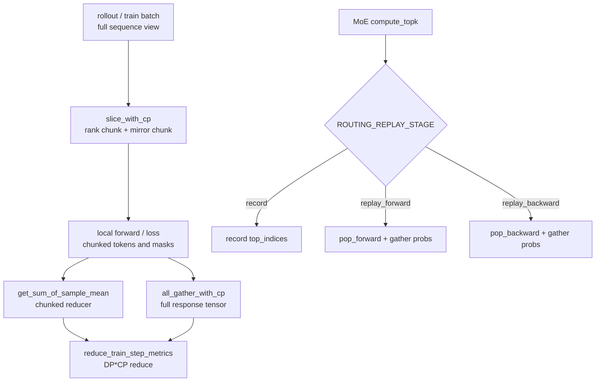

# CP · Routing Replay · 源码走读

这篇有两条主线：

1. **Context Parallelism 下的等价性**：每个 CP rank 只持有 zigzag 的两段 token/logits，但 loss、logprob、GAE、metrics 仍要等价于全序列计算。
2. **Routing Replay 下的确定性**：MoE gating 的 top-k 选择必须在 rollout/logprob/train forward/backward 之间复用，否则同一 token 可能走不同 experts，logprob、loss 和梯度路径就不再可比。

读源码时不要只看函数名。这里真正的设计问题是：**训练为了省显存和吞吐把序列与 expert routing 切散了，但优化目标仍要求“像没切散一样”做归约和复现。**

---

## 1. CP offset：为什么一个 rank 会拿两段

### 1.1 `get_logits_and_tokens_offset_with_cp` 定义 zigzag 坐标

**问题与约束：** Megatron CP 把长序列切给多个 rank。Slime 的 RL loss 只在 response token 上算，但 logits 与 token 有一位 shift：预测第 `t` 个 token 的 logits 位于 `t-1`。如果 offset 算错，prompt/response 边界会错一位。

**设计选择：** 每个 CP rank 持有两段：正向第 `rank` 段和反向镜像段。函数同时返回 chunk offset、logits offset 和 token offset，并把无效段规范化成 `(0, 0)` 空切片。

**Explain：** 所有 offset 都以完整 prompt+response 序列的起点为坐标原点。`chunk_size = ceil(total_length / (2 * cp_size))` 保证 `2 * cp_size` 个块覆盖整段序列；`logits_*` 再 clamp 到 response 需要的 `[prompt_length - 1, total_length - 1)`。

**Code：**

```python
## 来源：slime/backends/megatron_utils/cp_utils.py L9-L44
def get_logits_and_tokens_offset_with_cp(
    total_length: int,
    response_length: int,
):
    """
    All offsets start from the begining of the prompt.
    """
    cp_rank = mpu.get_context_parallel_rank()
    cp_size = mpu.get_context_parallel_world_size()
    assert cp_size > 1

    prompt_length = total_length - response_length
    chunk_size = (total_length + 2 * cp_size - 1) // (2 * cp_size)

    # the offset of 2 chunks
    chunk_0 = (cp_rank * chunk_size, (cp_rank + 1) * chunk_size)
    chunk_1 = ((2 * cp_size - cp_rank - 1) * chunk_size, (2 * cp_size - cp_rank) * chunk_size)

    # the offset of 2 logits, note that the logits need a "-1".
    logits_0 = (max(chunk_0[0], prompt_length - 1), min(chunk_0[1], total_length - 1))
    logits_1 = (max(chunk_1[0], prompt_length - 1), min(chunk_1[1], total_length - 1))

    # when the sequence is empty, make an empty slice to continue the gradient flow.
    if logits_0[0] < logits_0[1]:
        token_0 = (logits_0[0] + 1, logits_0[1] + 1)
    else:
        logits_0 = (0, 0)
        token_0 = (0, 0)

    if logits_1[0] < logits_1[1]:
        token_1 = (logits_1[0] + 1, logits_1[1] + 1)
    else:
        logits_1 = (0, 0)
        token_1 = (0, 0)

    return chunk_size, (chunk_0, chunk_1), (logits_0, logits_1), (token_0, token_1)
```

**代码逻辑：** 两个 chunk 先按完整序列坐标计算；logits 区间再裁到 response 需要的范围；token 区间相对 logits 右移一位。

**为什么这样写：** CP 的局部 rank 可能只覆盖 prompt、只覆盖 response、或横跨边界。把“全序列 chunk”和“response logits/token”同时返回，后续 slice/gather/loss reducer 能共享同一坐标系。

**不变量与失败模式：** `cp_size > 1` 是前提；空段必须变成 `(0,0)`，否则后续负长度或错位切片会破坏梯度路径。`prompt_length - 1` 是 logits 边界，不能写成 `prompt_length`。

**Comment：** 这是整篇 CP 逻辑的坐标原点。后面所有函数都在复用这套 zigzag offset。

### 1.2 chunk_size 与 prompt 边界的最小公式

**问题与约束：** response 可能短于某些 CP chunk；rank 的两段可能部分或完全落在 prompt 区间。

**设计选择：** 用同一 `chunk_size` 覆盖全序列，再把 logits 区间 clamp 到 response logits 范围。

**Explain：** 这几行是 offset 函数的数学核心：先保覆盖，再保 response 边界。

**Code：**

```python
## 来源：slime/backends/megatron_utils/cp_utils.py L20-L29
    prompt_length = total_length - response_length
    chunk_size = (total_length + 2 * cp_size - 1) // (2 * cp_size)

    # the offset of 2 chunks
    chunk_0 = (cp_rank * chunk_size, (cp_rank + 1) * chunk_size)
    chunk_1 = ((2 * cp_size - cp_rank - 1) * chunk_size, (2 * cp_size - cp_rank) * chunk_size)

    # the offset of 2 logits, note that the logits need a "-1".
    logits_0 = (max(chunk_0[0], prompt_length - 1), min(chunk_0[1], total_length - 1))
    logits_1 = (max(chunk_1[0], prompt_length - 1), min(chunk_1[1], total_length - 1))
```

**代码逻辑：** `2 * cp_size` 是每个 rank 两段；`ceil` padding 给后续 slice 使用；`max/min` 把 chunk 裁进 response logits。

**为什么这样写：** 如果先按 response 切，会丢失 CP 实际持有的序列布局；如果不 clamp，会把 prompt logits 也送进 RL loss。

**不变量与失败模式：** `total_length` 是 prompt+response；`response_length` 只用于计算 prompt 边界。两者一旦传反，所有 offset 都会错。

**Comment：** 这段解释了为什么 Slime 不能简单按 response 平均切片。

---

## 2. CP slice：把全序列数据切成本 rank 的两段

### 2.1 `slice_with_cp` 对 token/mask/专家路由复用同一布局

**问题与约束：** 训练数据里 tokens、loss mask、rollout routed experts 等张量都要与 Megatron CP 的 zigzag 布局一致；序列长度不能整除 `2 * cp_size` 时还要补齐。

**设计选择：** `slice_with_cp` 先 pad 到 `2 * cp_size * chunk_size`，再取 rank 对应的正向段和镜像段拼接。

**Explain：** 这是数据进入模型前的 CP 布局转换。`cp_size == 1` 时直接返回，避免无意义复制。

**Code：**

```python
## 来源：slime/backends/megatron_utils/cp_utils.py L287-L317
def slice_with_cp(
    tokens: torch.Tensor,
    pad_value: tuple[int, float, Callable],
) -> torch.Tensor:
    cp_rank = mpu.get_context_parallel_rank()
    cp_size = mpu.get_context_parallel_world_size()

    def pad_tokens(tokens, pad):
        if isinstance(pad_value, Callable):
            pad_func = pad_value
            tokens = pad_func(tokens, pad)
        else:
            # pad on the first dimension
            pad_tuple = (0, 0) * (tokens.dim() - 1) + (0, pad)
            tokens = F.pad(tokens, pad_tuple, value=pad_value)
        return tokens

    if cp_size == 1:
        return tokens

    token_len = len(tokens)
    chunk_size = (token_len + 2 * cp_size - 1) // (2 * cp_size)

    # pad
    pad = 2 * cp_size * chunk_size - token_len
    tokens = pad_tokens(tokens, pad)

    # get 2 chunk for thd cp
    start_1, end_1 = chunk_size * cp_rank, chunk_size * (cp_rank + 1)
    start_2, end_2 = chunk_size * (2 * cp_size - cp_rank - 1), chunk_size * (2 * cp_size - cp_rank)
    return torch.cat([tokens[start_1:end_1], tokens[start_2:end_2]])
```

**代码逻辑：** 先本地补齐；再切 `[rank]` 与 `[2*cp_size-rank-1]` 两段；最后沿第 0 维拼接。

**为什么这样写：** 模型 forward 看到的是 CP local 序列；loss mask 与 routed experts 必须走同样的切分，否则 token、mask、expert id 会错位。

**不变量与失败模式：** pad 只沿第 0 维；返回长度固定为 `2 * chunk_size`。如果 pad value 对张量语义不合法，后续 loss 或 routing replay 会引入假 token。

**Comment：** 这个函数是 `get_batch` 和 `fill_routing_replay` 共享 CP 布局的关键。

### 2.2 pad 可以是 Callable，给非标张量保留语义

**问题与约束：** token 可以用 0 pad，loss mask 可以用 0 pad，但 routed experts 这类张量需要按 expert id 范围构造合法填充值。

**设计选择：** `pad_value` 允许传 Callable，自定义 pad 行为。

**Explain：** actor 侧 `fill_routing_replay` 给 routed experts 传入 `pad_func`，就是为了避免 expert id pad 出非法值。

**Code：**

```python
## 来源：slime/backends/megatron_utils/cp_utils.py L294-L301
        if isinstance(pad_value, Callable):
            pad_func = pad_value
            tokens = pad_func(tokens, pad)
        else:
            # pad on the first dimension
            pad_tuple = (0, 0) * (tokens.dim() - 1) + (0, pad)
            tokens = F.pad(tokens, pad_tuple, value=pad_value)
```

**代码逻辑：** Callable 分支完全接管 pad；普通值分支用 `F.pad` 沿第 0 维补齐。

**为什么这样写：** CP slice 是通用布局函数，不应写死 token/mask 的 pad 语义。

**不变量与失败模式：** Callable 必须返回第 0 维增加 `pad` 的同类型张量；否则后续 chunk offset 会错。

**Comment：** 这是一个小设计点，但它让同一个 CP 切分函数能服务 token、mask 和 routing replay。

### 2.3 response-local logprob 要转回全序列 logits 坐标

**问题与约束：** rollout/logprob 常保存 response 长度的 logprob，而 CP offset 是完整 prompt+response 坐标。两者不在同一坐标系。

**设计选择：** `slice_log_prob_with_cp` 先 assert `len(log_prob) == response_length`，再用 `logits_offset - (prompt_length - 1)` 转成 response 局部坐标。

**Explain：** 这里切的是 response-local logprob，不是全序列 tokens。

**Code：**

```python
## 来源：slime/backends/megatron_utils/cp_utils.py L320-L344
def slice_log_prob_with_cp(
    log_prob: list[float] | torch.Tensor,
    total_length: int,
    response_length: int,
) -> list[float] | torch.Tensor:
    assert len(log_prob) == response_length, (
        f"log_prob length mismatch: len(log_prob)={len(log_prob)}, "
        f"response_length={response_length}, total_length={total_length}"
    )

    cp_size = mpu.get_context_parallel_world_size()

    if cp_size == 1:
        return log_prob

    prompt_length = total_length - response_length
    _, _, logits_offset, _ = get_logits_and_tokens_offset_with_cp(total_length, response_length)

    chunk_1 = log_prob[logits_offset[0][0] - (prompt_length - 1) : logits_offset[0][1] - (prompt_length - 1)]
    chunk_2 = log_prob[logits_offset[1][0] - (prompt_length - 1) : logits_offset[1][1] - (prompt_length - 1)]

    if isinstance(log_prob, list):
        return chunk_1 + chunk_2
    else:
        return torch.cat([chunk_1, chunk_2], dim=0)
```

**代码逻辑：** 使用 logits offset，而不是 token offset；list 返回 list 拼接，tensor 返回 `torch.cat`。

**为什么这样写：** logprob 序列已经去掉 prompt，只保留 response，所以必须减掉 response 起点对应的 logits 坐标。

**不变量与失败模式：** response_length 断言是保护线；如果 logprob 是 full sequence 长度，切出来会错而不是静默通过。

**Comment：** 这段体现了 CP 代码最容易错的地方：同一个 token 在 token、logits、response-local 三个坐标系里位置不同。

---

## 3. CP gather：从局部两段还原 response 全序列

### 3.1 `all_gather_with_cp` 用 zero pad + all_reduce 还原非重叠段

**问题与约束：** 每个 CP rank 只有 response logits 的局部片段，但 advantage、returns、value 或某些 logprob 路径需要 full response layout。真正的 gather 还要保留梯度。

**设计选择：** 每个 rank 构造一个 `[response_length]` full tensor：自己负责的区间放真实 chunk，其他区间放 `requires_grad=True` 的 zero；CP group 上 `dist.nn.all_reduce` 求和。

**Explain：** 因为各 rank 有效区间不重叠，all-reduce sum 等价于 gather。zero tensor 带 `requires_grad=True` 是为了不破坏 autograd 图的形状。

**Code：**

```python
## 来源：slime/backends/megatron_utils/cp_utils.py L235-L284
def all_gather_with_cp(tensor: torch.Tensor, total_length: int, response_length: int) -> torch.Tensor:
    """
    Gather tensors across all ranks in the context parallel group.
    The first dimension of the output tensor will be the `response_length`.
    """
    cp_group = mpu.get_context_parallel_group()
    cp_size = mpu.get_context_parallel_world_size()

    if cp_size == 1:
        return tensor

    _, _, logits_offset, _ = get_logits_and_tokens_offset_with_cp(total_length, response_length)

    prompt_length = total_length - response_length

    chunk_0 = tensor[: logits_offset[0][1] - logits_offset[0][0]]
    chunk_1 = tensor[logits_offset[0][1] - logits_offset[0][0] :]
    assert chunk_1.shape[0] == logits_offset[1][1] - logits_offset[1][0]

    def zero(len: int) -> torch.Tensor:
        return torch.zeros(
            [len] + list(tensor.shape[1:]),
            dtype=tensor.dtype,
            device=tensor.device,
            requires_grad=True,
        )

    # logprob should be within the range of [prompt_length - 1, total_length - 1]
    if chunk_0.shape[0] == 0 and chunk_1.shape[0] == 0:
        # all empty
        full_tensor = zero(response_length)
    elif chunk_0.shape[0] != 0 and chunk_1.shape[0] == 0:
        # only first chunk
        left = zero(logits_offset[0][0] - (prompt_length - 1))
        right = zero(total_length - 1 - logits_offset[0][1])
        full_tensor = torch.cat([left, chunk_0, right], dim=0)
    elif chunk_0.shape[0] == 0 and chunk_1.shape[0] != 0:
        # only second chunk
        left = zero(logits_offset[1][0] - (prompt_length - 1))
        right = zero(total_length - 1 - logits_offset[1][1])
        full_tensor = torch.cat([left, chunk_1, right], dim=0)
    else:
        left = zero(logits_offset[0][0] - (prompt_length - 1))
        mid = zero(logits_offset[1][0] - logits_offset[0][1])
        right = zero(total_length - 1 - logits_offset[1][1])
        full_tensor = torch.cat([left, chunk_0, mid, chunk_1, right], dim=0)

    assert full_tensor.shape[0] == response_length, f"Expected {response_length}, got {full_tensor.shape}"
    full_tensor = dist.nn.all_reduce(full_tensor, group=cp_group)
    return full_tensor
```

**代码逻辑：** 局部 tensor 先按两个 logits chunk 长度拆开；根据 chunk 是否为空选择拼接方式；最后 assert 长度并 all_reduce。

**为什么这样写：** 用 all_reduce 避免显式 all_gather 后再重排；由于每个位置只有一个 rank 写真实值，sum 就是全序列。

**不变量与失败模式：** `tensor` 的第 0 维必须等于本 rank 两段 logits 的总长度。若两个 rank 的有效区间重叠，sum 会重复；若有空洞，full tensor 对应位置会是 zero。

**Comment：** 这段是 CP 下“局部算、全局看”的核心桥接。

### 3.2 只有 chunk_0 有效时仍要拼满 response_length

**问题与约束：** 某些 rank 的镜像段可能完全落在 prompt 或 pad 区间，因此只有第一段有效。

**设计选择：** 对只含 `chunk_0` 的情况，用 left/right zero pad 拼出完整 response 长度，再参与 all_reduce。

**Explain：** 空段不是异常，它是短 response 与 zigzag CP 组合时的正常情况。

**Code：**

```python
## 来源：slime/backends/megatron_utils/cp_utils.py L266-L270
    elif chunk_0.shape[0] != 0 and chunk_1.shape[0] == 0:
        # only first chunk
        left = zero(logits_offset[0][0] - (prompt_length - 1))
        right = zero(total_length - 1 - logits_offset[0][1])
        full_tensor = torch.cat([left, chunk_0, right], dim=0)
```

**代码逻辑：** `left` 补 response 起点到 `chunk_0` 起点；`right` 补 `chunk_0` 终点到 response 终点。

**为什么这样写：** all_reduce 要求每个 rank 的 full tensor 形状一致，哪怕该 rank 只贡献其中一小段。

**不变量与失败模式：** `logits_offset[0]` 必须已经是 response logits 坐标；否则 left/right 长度可能为负或总长不等于 response_length。

**Comment：** 这个分支是 CP 边界 case 的最小样本。

---

## 4. CP reducer：loss 与指标怎样避免重复计数

### 4.1 `get_sum_of_sample_mean` 的 legacy 分母

**问题与约束：** 旧逻辑按每个 sample 自己的 `loss_mask.sum()` 做均值；新逻辑可能按 rollout group 分母做 token-weighted mean。两者不能混在一起。

**设计选择：** `sample_denoms is None` 时退化到 legacy per-sample mean；否则使用调用方传入的分母。

**Explain：** reducer 返回的是一个闭包，后续 loss 函数可以把任意逐 token 张量交给它统一求和/平均。

**Code：**

```python
## 来源：slime/backends/megatron_utils/cp_utils.py L67-L80
    if sample_denoms is None:
        sample_denoms = [m.sum() for m in loss_masks]

    cp_size = mpu.get_context_parallel_world_size()
    if cp_size == 1:

        def sum_of_sample_mean(x: torch.Tensor) -> torch.Tensor:
            return sum(
                [
                    (x_i * loss_mask_i).sum() / torch.clamp_min(denom, 1)
                    for x_i, loss_mask_i, denom in zip(
                        x.split(response_lengths, dim=0), loss_masks, sample_denoms, strict=False
                    )
                ]
            )
```

**代码逻辑：** CP size 为 1 时按 response_lengths split；每段乘 mask，再除 clamp 后的 denom。

**为什么这样写：** 保留旧语义是为了兼容不传 rollout-level denominator 的路径；`clamp_min(denom, 1)` 防止全 mask 为 0 时除零。

**不变量与失败模式：** `x` 的第 0 维必须按 sample response_lengths 串接；sample_denoms 的顺序必须与 loss_masks 对齐。

**Comment：** 这段说明 loss reducer 同时服务 per-sample 和 per-rollout 两种统计语义。

### 4.2 CP 分支按 token offset 切 loss mask

**问题与约束：** CP rank 只持有 response 的局部 token，不能直接用 full response loss_mask 乘局部 loss。

**设计选择：** 对每个 sample 调用 offset 函数，按 `tokens_offset - prompt_length` 从 response-local mask 中切出两段，再记录局部 chunk length。

**Explain：** CP 下 `x.split(...)` 的长度不是 response_lengths，而是每个 sample 在当前 rank 上的 CP chunk length。

**Code：**

```python
## 来源：slime/backends/megatron_utils/cp_utils.py L91-L124
    else:
        cp_chunk_lengths: list[int] = []
        chunked_loss_masks: list[torch.Tensor] = []

        for total_length, response_length, loss_mask in zip(total_lengths, response_lengths, loss_masks, strict=False):
            prompt_length = total_length - response_length
            _, _, _, tokens_offset = get_logits_and_tokens_offset_with_cp(total_length, response_length)
            loss_mask_0 = loss_mask[tokens_offset[0][0] - prompt_length : tokens_offset[0][1] - prompt_length]
            loss_mask_1 = loss_mask[tokens_offset[1][0] - prompt_length : tokens_offset[1][1] - prompt_length]
            chunked_loss_mask = torch.cat([loss_mask_0, loss_mask_1], dim=0)
            chunked_loss_masks.append(chunked_loss_mask)
            cp_chunk_lengths.append(chunked_loss_mask.size(0))

        def sum_of_sample_mean(x: torch.Tensor) -> torch.Tensor:
            return sum(
                [
                    (x_i * chunked_loss_mask).sum() / torch.clamp_min(denom, 1)
                    for x_i, chunked_loss_mask, denom in zip(
                        x.split(cp_chunk_lengths, dim=0), chunked_loss_masks, sample_denoms, strict=False
                    )
                ]
            )

        def sum_of_token(x: torch.Tensor) -> torch.Tensor:
            return sum(
                [
                    (x_i * chunked_loss_mask).sum()
                    for x_i, chunked_loss_mask in zip(
                        x.split(cp_chunk_lengths, dim=0), chunked_loss_masks, strict=False
                    )
                ]
            )

    return sum_of_sample_mean if not calculate_per_token_loss else sum_of_token
```

**代码逻辑：** CP 分支预先构造 `chunked_loss_masks` 和 `cp_chunk_lengths`；闭包里按这些局部长度切 `x`。

**为什么这样写：** loss 函数只看到局部拼接后的 token loss，必须用同样的局部 mask 和 split 长度才能保持样本边界。

**不变量与失败模式：** `x` 必须按 sample 顺序拼接 CP local chunks；`total_lengths/response_lengths/loss_masks` 三个列表必须一一对应。

**Comment：** 这里把 CP 坐标变成了 loss reducer 的“局部样本边界”。

### 4.3 per-token loss 不在闭包里除分母

**问题与约束：** `calculate_per_token_loss=True` 时，真正分母要跨 DP*CP group 统计，不能在每个 sample 局部先除。

**设计选择：** 返回 `sum_of_token` 闭包，只做 mask 后求和；最终由 `reduce_train_step_metrics` 统一除 token 数。

**Explain：** per-token 模式把“求和”和“除法”拆开，避免 CP rank 上局部分母导致平均偏差。

**Code：**

```python
## 来源：slime/backends/megatron_utils/cp_utils.py L114-L124
        def sum_of_token(x: torch.Tensor) -> torch.Tensor:
            return sum(
                [
                    (x_i * chunked_loss_mask).sum()
                    for x_i, chunked_loss_mask in zip(
                        x.split(cp_chunk_lengths, dim=0), chunked_loss_masks, strict=False
                    )
                ]
            )

    return sum_of_sample_mean if not calculate_per_token_loss else sum_of_token
```

**代码逻辑：** 不使用 `sample_denoms`，只对局部有效 token 求和。

**为什么这样写：** per-token 全局平均必须等所有 rank 的 numerator/denominator 都归约后再算。

**不变量与失败模式：** 调用方必须在 metrics reduce 阶段提供正确 token 分母；否则这里只返回 sum 会被误解为 mean。

**Comment：** 这是 `get_sum_of_sample_mean` 和 `reduce_train_step_metrics` 的分工边界。

### 4.4 train step metrics 用 cp_factor 修正 CP 膨胀

**问题与约束：** loss 函数返回的 metrics 要跨 microbatch、DP、CP 聚合。per-token 模式下，某些 token count 来自 full mask，会在 CP rank 上重复出现。

**设计选择：** 先本地 sum，再对 DP*CP group all_reduce；per-token 模式用 `cp_factor=cp_size` 修正，per-rollout mean 用固定 `step_global_batch_size`。

**Explain：** 这段把 loss reducer 的局部输出变成 train log 中的全局标量。

**Code：**

```python
## 来源：slime/backends/megatron_utils/cp_utils.py L127-L168
def reduce_train_step_metrics(
    losses_reduced: list[dict],
    *,
    calculate_per_token_loss: bool,
    step_global_batch_size: int,
    cp_size: int,
    dp_with_cp_group,
) -> dict[str, float]:
    """Aggregate per-mb log dicts into the dict ``train_one_step`` reports.

    Pipeline (1:1 with what the train loop used to do inline):
      1. Sum each metric's per-mb ``values`` tensor locally on this rank.
      2. All-reduce across the DP*CP group (``dp_with_cp_group``).
      3. Apply the per-mode divisor / cp_factor:
         - per-token-loss: divisor = ``values[0]`` = all-reduced ``num_tokens``,
           CP-inflated by ``cp_size`` because every CP rank computes the same
           num_tokens off the FULL (not chunked) masks; the
           ``cp_factor = cp_size`` multiplier cancels that inflation, leaving
           the genuine per-token average.
         - per-rollout-mean: divisor = constant ``step_global_batch_size`` from
           the rollout side, never all-reduced, so no CP inflation to cancel
           and ``cp_factor = 1``.
    """
    keys = losses_reduced[0]["keys"]
    values = None
    for x in losses_reduced:
        values = x["values"] if values is None else values + x["values"]
    assert len(keys) + 1 == values.numel()
    dist.all_reduce(values, group=dp_with_cp_group)
    values = values.tolist()

    if calculate_per_token_loss:
        num_samples_or_tokens = values[0]
        cp_factor = cp_size
    else:
        num_samples_or_tokens = step_global_batch_size
        cp_factor = 1
    return {key: value * cp_factor / num_samples_or_tokens for key, value in zip(keys, values[1:], strict=False)}
```

**代码逻辑：** `values[0]` 是分母槽位；其余 values 与 keys 对齐；最后按模式决定 divisor 和 cp_factor。

**为什么这样写：** metrics reduce 统一处理 CP 重复计数，比在每个 loss 项里单独修正更不容易遗漏。

**不变量与失败模式：** `losses_reduced` 必须至少一项；所有 dict 的 keys 顺序必须一致。per-token 模式要求 values[0] 真的是 token count。

**Comment：** 这段是 CP loss 数值等价性的最后一步。

### 4.5 测试通过 mock group 复用生产调用形状

**问题与约束：** CP/DP reduce 很难在单进程单测里真实起多组通信，但仍要测试 reducer 的数学逻辑。

**设计选择：** docstring 明确测试可传 mock `dp_with_cp_group`，并 monkeypatch `dist.all_reduce` 为 no-op，让测试自己预聚合虚拟 ranks。

**Explain：** 这让单测覆盖函数调用形状，而不是把测试写成另一套实现。

**Code：**

```python
## 来源：slime/backends/megatron_utils/cp_utils.py L150-L152
    Tests pass a mock ``dp_with_cp_group`` and monkeypatch ``dist.all_reduce``
    to a no-op, then pre-aggregate virtual ranks themselves
```

**代码逻辑：** 生产函数仍接受 group 参数；测试只替换通信副作用。

**为什么这样写：** 分布式代码最怕测试只测纯数学、不测调用边界。保留 group 参数能让测试与生产签名一致。

**不变量与失败模式：** mock 测试无法证明真实 backend group 配置正确；它只证明给定聚合值时 reducer 公式正确。

**Comment：** 这也是为什么维护 CP 工具时要同时看测试和生产调用点。

### 4.6 rollout 侧日志用 `(sum, count)` 与 train 对齐

**问题与约束：** rollout log 和 train log 可能在不同 rank/CP 视角下统计。若 rollout 侧简单平均 rank 标量，会和 train step 的 per-rollout mean 不在同一空间。

**设计选择：** `rollout_log_metric_contribution` 返回 `(sum, count)`，后续 gather 按 `Σsum / Σcount` reduce。

**Explain：** 这里把每 rank 的 reducer sum 转成可跨 DP*CP 聚合的贡献。

**Code：**

```python
## 来源：slime/backends/megatron_utils/cp_utils.py L171-L194
def rollout_log_metric_contribution(
    per_rank_reducer_sum: float,
    *,
    cp_size: int,
    num_rollouts_in_rollout: int,
    dp_size: int,
) -> tuple[float, float]:
    """``(sum, count)`` tuple to hand the gather step for a per-rollout-mean
    metric on the rollout side (``log_rollout_data``).

    Sum across DP*CP ranks of ``count`` lands on ``num_rollouts_in_rollout``
    (``dp_size`` here is the no-CP DP width; the gather covers ``dp_size *
    cp_size`` ranks, and each rank emits the same ``count``, so the totals
    cancel out the ``cp_size`` in the sum). Result: ``Σsum / Σcount =
    sum_DP_full / num_rollouts`` — the same number ``train_one_step`` reports
    for the same samples (when ``num_steps_per_rollout == 1``).
    """
    sum_value = cp_size * per_rank_reducer_sum
    count = num_rollouts_in_rollout / dp_size
    return sum_value, count
```

**代码逻辑：** sum 乘 `cp_size`；count 按 no-CP DP width 分摊。

**为什么这样写：** CP rank 之间持有的是同一 rollout 的切片，不是更多 rollout；用 `(sum,count)` 能表达“这是同一组样本的部分贡献”。

**不变量与失败模式：** `dp_size` 这里指不含 CP 的 DP 宽度；传成 DP*CP 会把 count 算小。

**Comment：** 这段服务的是可观测性一致性：同一批样本在 rollout/train 两侧应该能对上。

### 4.7 `gather_and_reduce_log_dict` 支持 tuple 和 legacy 标量

**问题与约束：** 新日志可能是 `(sum,count)`，旧日志可能还是纯标量。一次 gather 需要同时处理两种 key。

**设计选择：** source rank gather object 后按每个 key 的 value 类型选择 `Σsum/Σcount` 或 `Σ/dp_size`。

**Explain：** 这个 helper 无副作用，只做 gather 与 reduce，调用方负责命名和写日志。

**Code：**

```python
## 来源：slime/backends/megatron_utils/cp_utils.py L197-L232
def gather_and_reduce_log_dict(
    log_dict: dict,
    *,
    dp_size: int,
    dp_src_rank: int,
    dp_group,
) -> dict | None:
    """``dist.gather_object`` per-rank log_dicts + per-key reduction.

    Per key in the gathered dicts:
      - ``(sum, count)`` tuple → ``Σsum / Σcount`` (per-rollout-mean shape;
        pair with :func:`rollout_log_metric_contribution`).
      - plain value → ``Σ / dp_size`` (legacy mean-across-ranks; the only
        correct answer when ranks hold the same data).
    """
    if dist.get_rank() == dp_src_rank:
        gathered = [None] * dp_size
        dist.gather_object(log_dict, gathered, dst=dp_src_rank, group=dp_group)
        reduced: dict = {}
        for key in log_dict:
            values = [d[key] for d in gathered]
            first = values[0]
            if isinstance(first, tuple) and len(first) == 2:
                total_sum = sum(v[0] for v in values)
                total_count = sum(v[1] for v in values)
                reduced[key] = total_sum / total_count if total_count else 0.0
            else:
                reduced[key] = sum(values) / dp_size
        return reduced
    dist.gather_object(log_dict, None, dst=dp_src_rank, group=dp_group)
    return None
```

**代码逻辑：** 只有 `dp_src_rank` 返回 reduced dict；其他 rank 参与 gather 后返回 None。

**为什么这样写：** object gather 允许混合 Python tuple 和标量，适合日志而不是训练 tensor。

**不变量与失败模式：** 所有 rank 的 `log_dict` 必须有相同 key；legacy 标量平均只在各 rank 持有同等语义统计时正确。

**Comment：** 这段是 rollout/train 指标空间对齐的收尾。

### 4.8 rollout log 侧把 tensor 转成 `(sum,count)`

**问题与约束：** rollout 侧的 tensor 指标在 CP 下可能只代表本 rank 切片。直接 mean 后跨 rank 平均会改变语义。

**设计选择：** rollout log 中对 tensor 计算 per-rank sum 和 count，并放入 `log_dict[key] = (sum_value, count)`。

**Explain：** 这里是 `rollout_log_metric_contribution` 思想在 rollout logging 代码里的落点。

**Code：**

```python
## 来源：slime/backends/megatron_utils/data.py L331-L337
                    # val.mean() * cp_size is the per-sample mean for one rank;
                    # multiply by count to get the per-rank sum.
                    per_rank_sum = tensor.mean() * cp_size * count
                    sum_value = per_rank_sum.item()
                else:
                    sum_value = sum(val)
                log_dict[key] = (sum_value, count)
```

**代码逻辑：** tensor mean 先乘 `cp_size` 还原每样本贡献，再乘 count 得到 sum。

**为什么这样写：** 日志 reducer 需要 sum/count 形态才能跨 DP/CP 正确平均。

**不变量与失败模式：** 这里假设 count 与 tensor 指标的样本数量匹配；若 tensor 已经是全局均值，再乘 count 会重复放大。

**Comment：** 日志也要尊重 CP 语义，否则训练数值正确但监控误导。

---

## 5. RoutingReplay：把 MoE top-k 选择变成可复用状态

### 5.1 全局指针由当前 MoE module 的 pre-hook 设置

**问题与约束：** Megatron 的 MoE `compute_topk` 通常不知道自己属于哪一层 module；但 replay 需要每层维护独立 top_indices 队列。

**设计选择：** 每个 MoE module 注册一个 `RoutingReplay` 实例；forward pre-hook 在进入该 module 前把全局 `ROUTING_REPLAY` 指向它。

**Explain：** 这是一个轻量动态上下文：全局函数 wrapper 通过全局指针找到“当前层”的 replay buffer。

**Code：**

```python
## 来源：slime/utils/routing_replay.py L7-L10
def set_routing_replay(replay):
    global ROUTING_REPLAY
    ROUTING_REPLAY = replay
```

**代码逻辑：** 只改模块级全局变量。

**为什么这样写：** compute_topk wrapper 没有 module self 参数，用全局指针是接入 Megatron 内部函数的低侵入办法。

**不变量与失败模式：** pre-hook 必须在每个 MoE layer forward 前触发；否则 `ROUTING_REPLAY` 可能指向上一层或 None。

**Comment：** RoutingReplay 不是普通对象调用链，而是靠 hook + 全局指针接入 Megatron MoE。

### 5.2 `RoutingReplay` 保存 CPU pinned top_indices

**问题与约束：** top_indices 需要跨 logprob forward、train forward、backward 多次复用；一直放 GPU 会占显存。

**设计选择：** record 时 copy 到 CPU pinned memory；pop 时再搬回当前 CUDA device。forward/backward 用两个 index 独立消费同一列表。

**Explain：** forward 与 backward 都要按同一 expert routing 执行，但二者在 Megatron 1F1B 调度中消费时机不同，所以需要两个游标。

**Code：**

```python
## 来源：slime/utils/routing_replay.py L13-L54
class RoutingReplay:
    all_routing_replays = []

    def __init__(self):
        self.forward_index = 0
        self.backward_index = 0
        self.top_indices_list = []
        RoutingReplay.all_routing_replays.append(self)

    def record(self, top_indices):
        # offload top_indices to CPU pinned memory
        buf = torch.empty_like(top_indices, device="cpu", pin_memory=True)
        buf.copy_(top_indices)
        self.top_indices_list.append(buf)

    def pop_forward(self):
        top_indices = self.top_indices_list[self.forward_index]
        self.forward_index += 1
        return top_indices.to(torch.cuda.current_device())

    def pop_backward(self):
        top_indices = self.top_indices_list[self.backward_index]
        self.backward_index += 1
        return top_indices.to(torch.cuda.current_device())

    def clear(self):
        self.forward_index = 0
        self.backward_index = 0
        self.top_indices_list = []

    def clear_forward(self):
        self.forward_index = 0

    @staticmethod
    def clear_all():
        for replay in RoutingReplay.all_routing_replays:
            replay.clear()

    @staticmethod
    def clear_all_forward():
        for replay in RoutingReplay.all_routing_replays:
            replay.clear_forward()
```

**代码逻辑：** `all_routing_replays` 收集所有层实例；`record` 追加 CPU buffer；`pop_forward/pop_backward` 分别推进自己的游标。

**为什么这样写：** 同一批 top_indices 要给 train forward 和 backward 各消费一次。只用一个游标会让 forward 消费后 backward 找不到对应 routing。

**不变量与失败模式：** `top_indices_list` 长度必须覆盖后续 pop 次数；`clear_all_forward` 只重置 forward 游标，不清空列表，也不动 backward 游标。

**Comment：** 这段是 routing replay 的状态核心。

### 5.3 compute_topk wrapper 用环境变量选择阶段

**问题与约束：** 同一个 patched `compute_topk` 要支持普通运行、记录 routing、重放 forward routing、重放 backward routing。

**设计选择：** 用 `ENABLE_ROUTING_REPLAY` 和 `ROUTING_REPLAY_STAGE` 控制行为。`record` 调原始 topk 后保存；`replay_*` 直接取记录的 top_indices，并用当前 scores gather probs。

**Explain：** replay 不是复用旧 probs，而是复用旧 expert ids，再从当前 scores 中取对应概率。这保证梯度仍来自当前 forward scores。

**Code：**

```python
## 来源：slime/utils/routing_replay.py L57-L82
def get_routing_replay_compute_topk(old_compute_topk):
    def compute_topk(scores, topk, num_groups=None, group_topk=None):
        if os.environ.get("ENABLE_ROUTING_REPLAY", "0") == "1":
            routing_replay_stage = os.environ["ROUTING_REPLAY_STAGE"]
            if routing_replay_stage == "fallthrough":
                return old_compute_topk(scores, topk, num_groups=num_groups, group_topk=group_topk)
            if routing_replay_stage == "record":
                probs, top_indices = old_compute_topk(scores, topk, num_groups=num_groups, group_topk=group_topk)
                ROUTING_REPLAY.record(top_indices)
            elif routing_replay_stage == "replay_forward":
                top_indices = ROUTING_REPLAY.pop_forward()
                assert (
                    top_indices.shape[0] == scores.shape[0] and top_indices.shape[1] == topk
                ), f"[{torch.distributed.get_rank()}] top_indices shape {top_indices.shape} does not match scores shape {scores.shape} and topk {topk}"
                probs = scores.gather(1, top_indices)
            elif routing_replay_stage == "replay_backward":
                top_indices = ROUTING_REPLAY.pop_backward()
                assert (
                    top_indices.shape[0] == scores.shape[0] and top_indices.shape[1] == topk
                ), f"top_indices shape {top_indices.shape} does not match scores shape {scores.shape} and topk {topk}"
                probs = scores.gather(1, top_indices)
            return probs, top_indices
        else:
            return old_compute_topk(scores, topk, num_groups=num_groups, group_topk=group_topk)

    return compute_topk
```

**代码逻辑：** replay 分支都 assert shape；fallthrough 和 disabled 都调用原函数。

**为什么这样写：** 环境变量能跨 Ray actor、Megatron 内部函数和 hook 注入路径生效，不需要把 stage 参数穿过 Megatron 层层调用。

**不变量与失败模式：** `ROUTING_REPLAY_STAGE` 必须是已知值；源码没有 unknown stage 的显式 error，未知值会导致 `probs/top_indices` 未定义。replay 形状必须和当前 scores 对齐。

**Comment：** replay 的关键是固定 expert 路径，但仍让当前 scores 参与梯度。

### 5.4 replay_forward 形状断言保护 token/expert 对齐

**问题与约束：** 如果当前 microbatch layout、CP slice、SP slice 或 topk 与记录时不同，重放的 top_indices 会对应错 token。

**设计选择：** replay 分支 assert `top_indices.shape == [scores.shape[0], topk]`。

**Explain：** 形状不能证明 token 顺序完全一致，但能拦住最常见的 batch/topk 错配。

**Code：**

```python
## 来源：slime/utils/routing_replay.py L68-L71
                assert (
                    top_indices.shape[0] == scores.shape[0] and top_indices.shape[1] == topk
                ), f"[{torch.distributed.get_rank()}] top_indices shape {top_indices.shape} does not match scores shape {scores.shape} and topk {topk}"
```

**代码逻辑：** 第 0 维对 token 数，第 1 维对 topk。

**为什么这样写：** routing replay 靠 token 顺序一致来成立；形状断言是最低成本的防线。

**不变量与失败模式：** 形状一致但 token 顺序错仍可能通过；这需要 `fill_routing_replay` 与 `get_batch` 共享切分路径来保证。

**Comment：** 所以后面 actor 侧预填 routing replay 必须复用 `slice_with_cp`。

### 5.5 `register_routing_replay` 给 module 安装实例和 hook

**问题与约束：** 每层 MoE 都需要自己的 replay buffer；全局 wrapper 必须知道当前 forward 进入哪一层。

**设计选择：** 注册时给 module 加 `routing_replay` 属性，并用 forward pre-hook 调 `set_routing_replay`。

**Explain：** 这把“层级上下文”绑定到 Megatron module 生命周期，而不是绑定到外部训练 loop。

**Code：**

```python
## 来源：slime/utils/routing_replay.py L85-L92
def register_routing_replay(module):
    if os.environ.get("ENABLE_ROUTING_REPLAY", "0") == "1":
        module.routing_replay = RoutingReplay()

        def pre_forward_hook(*args, **kwargs):
            set_routing_replay(module.routing_replay)

        module.register_forward_pre_hook(pre_forward_hook)
```

**代码逻辑：** 只有启用环境变量时才注册；hook 在 module forward 前切换全局 replay 指针。

**为什么这样写：** 不启用 replay 时不改变 module；启用时保持对 Megatron 代码侵入最小。

**不变量与失败模式：** hook 顺序必须早于 MoE gating 的 compute_topk；如果 module 没有注册，compute_topk wrapper 读不到正确 replay。

**Comment：** RoutingReplay 是通过 monkey patch/hook 风格接入，而不是改 Megatron 原始 MoE 类。

---

## 6. actor 侧：routing replay 的生命周期

### 6.1 `use_rollout_routing_replay` 自动打开 `use_routing_replay`

**问题与约束：** rollout routing replay 是 routing replay 的特例：top_indices 来自 rollout，而不是本地 logprob record。它必须启用同一套 replay patch。

**设计选择：** 参数 validate 阶段把 `use_rollout_routing_replay` 推导成 `use_routing_replay=True`。

**Explain：** 这避免用户只打开 rollout replay，却忘记打开基础 routing replay patch。

**Code：**

```python
## 来源：slime/utils/arguments.py L1950-L1951
    if args.use_rollout_routing_replay:
        args.use_routing_replay = True
```

**代码逻辑：** 单向推导，不反推。

**为什么这样写：** rollout replay 没有基础 patch 无法生效；把派生关系放在参数层比训练中报错更早。

**不变量与失败模式：** 只设置 `use_routing_replay=True` 不代表使用 rollout 侧 experts；它可能走本地 record/replay。

**Comment：** 参数层先建立“能力开关”的包含关系。

### 6.2 Ray 只给 actor 注入 `ENABLE_ROUTING_REPLAY`

**问题与约束：** critic 不应做 routing replay；replay 只服务 actor MoE 路径对齐。

**设计选择：** Ray actor group 创建环境变量时检查 `use_routing_replay and role == "actor"`。

**Explain：** 环境变量是 compute_topk wrapper 的启用条件，因此必须只注入到需要 patch 的 actor 进程。

**Code：**

```python
## 来源：slime/ray/actor_group.py L86-L88
        # We cannot do routing replay for critic.
        if self.args.use_routing_replay and self.role == "actor":
            env_vars["ENABLE_ROUTING_REPLAY"] = "1"
```

**代码逻辑：** critic role 即使参数打开也不会得到 env var。

**为什么这样写：** critic/value 路径和 actor policy 路径职责不同；强行 replay critic routing 会混淆训练语义。

**不变量与失败模式：** 如果 actor 进程没有拿到环境变量，`register_routing_replay` 和 compute_topk wrapper 都不会真正启用。

**Comment：** routing replay 是 actor-side 机制，不是全训练后端通用机制。

### 6.3 rollout experts 预填时复用 CP/SP 布局

**问题与约束：** `use_rollout_routing_replay` 时，top_indices 来自 rollout engine 返回的 `rollout_routed_experts`。训练侧必须把这些 experts 变成与 Megatron train microbatch 完全一致的布局。

**设计选择：** `fill_routing_replay` 校验数据存在，按 token 长度补最后一位，调用 `slice_with_cp`，再按 TP/SP 切片，最后逐 MoE layer record 到 `RoutingReplay.all_routing_replays`。

**Explain：** 这段是 rollout routing replay 的对齐核心：不是直接把 rollout experts 塞进 replay，而是走与训练 batch 相同的 CP/SP 切分。

**Code：**

```python
## 来源：slime/backends/megatron_utils/actor.py L284-L357
    def fill_routing_replay(self, data_iterator, num_microbatches, rollout_data):
        if "rollout_routed_experts" not in rollout_data:
            raise ValueError(
                "rollout_routed_experts is required in rollout_data when use_rollout_routing_replay is set."
            )

        from megatron.core.transformer.transformer_block import get_num_layers_to_build
        from megatron.core.transformer.transformer_layer import get_transformer_layer_offset

        from slime.utils.routing_replay import RoutingReplay

        for iterator in data_iterator:
            iterator.reset()

        tp_rank = mpu.get_tensor_model_parallel_rank()
        tp_size = mpu.get_tensor_model_parallel_world_size()

        def pad_func(experts, pad):
            _, num_layers, topk = experts.shape
            pad = (
                torch.arange(
                    pad * num_layers * topk,
                    device=experts.device,
                    dtype=experts.dtype,
                ).reshape((pad, num_layers, topk))
                % self.args.num_experts
            )
            return torch.cat([experts, pad], dim=0)

        for _ in range(sum(num_microbatches)):
            batch = data_iterator[0].get_next(["rollout_routed_experts", "tokens"])
            rollout_routed_experts = batch["rollout_routed_experts"]
            tokens = batch["tokens"]
            assert len(rollout_routed_experts) == len(tokens)
            for a, b in zip(rollout_routed_experts, tokens, strict=False):
                assert a.shape[0] == b.shape[0] - 1, f"{a.shape}, {b.shape}"

            # We need to pad the experts to the last token. We won't calculate loss on this token so this should be fine.
            # TODO: fuse this padding with the following slice_with_cp to reduce memory copy.
            rollout_routed_experts = [pad_func(r, 1) for r in rollout_routed_experts]
            # TODO: maybe extract a common process function for here and get_batch?
            rollout_routed_experts = [slice_with_cp(r, pad_func) for r in rollout_routed_experts]
            rollout_routed_experts = torch.cat(rollout_routed_experts, dim=0)
            pad_size = mpu.get_tensor_model_parallel_world_size() * self.args.data_pad_size_multiplier
            pad = (pad_size - rollout_routed_experts.size(0) % pad_size) % pad_size
            if pad != 0:
                rollout_routed_experts = pad_func(rollout_routed_experts, pad)

            if self.args.sequence_parallel:
                seqlen = rollout_routed_experts.size(0)
                assert seqlen % tp_size == 0
                start, end = seqlen // tp_size * tp_rank, seqlen // tp_size * (tp_rank + 1)
                rollout_routed_experts = rollout_routed_experts[start:end]

            routing_replay_offset = 0
            for vp_stage, model in enumerate(self.model):
                config = model.module.config
                num_layers_to_build = get_num_layers_to_build(config, vp_stage=vp_stage)
                offset = get_transformer_layer_offset(config, vp_stage=vp_stage)
                for layer_id in range(offset, offset + num_layers_to_build):
                    # skip dense layer
                    if isinstance(config.moe_layer_freq, int):
```

**代码逻辑：** experts 长度比 tokens 少 1，因为 routed experts 对应 logits/next-token 位置；先补一位再 CP slice；sequence parallel 再按 TP rank 切；最后按实际 MoE layer 顺序 record。

**为什么这样写：** routing replay 依赖 token 顺序与 layer 顺序完全一致。只要 rollout experts 的布局和 train forward 不一致，replay 就会把 token 路由到错误 expert。

**不变量与失败模式：** `rollout_routed_experts` 必须存在；每条 expert 序列长度必须是 token length - 1；`routing_replay_offset` 最终必须等于 replay 实例数。

**Comment：** 这段把 CP slice、SP slice 和 MoE layer mapping 连接在一起，是 rollout replay 最重要的证据。

### 6.4 actor 训练前后设置 routing replay stage

**问题与约束：** 同一 rollout 要经历 ref/teacher logprob、actor logprob、advantage 计算、train forward/backward。不同阶段对 routing replay 的需求不同。

**设计选择：** ref/teacher 走 `fallthrough`；actor logprob 根据是否使用 rollout experts 走 `replay_forward` 或 `record`；训练前设置 `replay_backward`；训练结束清空所有 replay。

**Explain：** `train_actor` 是 stage 生命周期的编排者，`model.train_one_step` 只在训练 forward 内临时切 replay_forward。

**Code：**

```python
## 来源：slime/backends/megatron_utils/actor.py L430-L539
    def train_actor(self, rollout_id: int, rollout_data: RolloutBatch, external_data=None) -> None:
        # Create data iterator for log_probs and train.
        data_iterator = get_data_iterator(rollout_data)
        num_microbatches = rollout_data["num_microbatches"]
        global_batch_sizes = rollout_data["global_batch_sizes"]

        if self.args.use_rollout_routing_replay:
            self.fill_routing_replay(data_iterator, num_microbatches, rollout_data)

        with inverse_timer("train_wait"), timer("train"):
            if self.args.compute_advantages_and_returns:
                if "ref" in self.weights_backuper.backup_tags:
                    if self.args.use_routing_replay:
                        os.environ["ROUTING_REPLAY_STAGE"] = "fallthrough"
                    self._switch_model("ref")
                    rollout_data.update(
                        self.compute_log_prob(
                            data_iterator,
                            num_microbatches,
                            store_prefix="ref_",
                        )
                    )

                # Forward teacher model to get teacher_log_probs for Megatron-based OPD
                if "teacher" in self.weights_backuper.backup_tags:
                    if self.args.use_routing_replay:
                        os.environ["ROUTING_REPLAY_STAGE"] = "fallthrough"
                    self._switch_model("teacher")
                    rollout_data.update(
                        self.compute_log_prob(
                            data_iterator,
                            num_microbatches,
                            store_prefix="teacher_",
                        )
                    )

                self._switch_model("old_actor" if self.args.keep_old_actor else "actor")
                can_reuse_log_probs_in_loss = (
                    len(num_microbatches) == 1
                    and self.args.loss_type == "policy_loss"
                    and self.args.kl_coef == 0
                    and not self.args.use_rollout_logprobs
                    and not self.args.get_mismatch_metrics
                    and not self.args.use_critic
                    and not self.args.keep_old_actor
                    and not self.args.use_opd
                    and not self.args.use_routing_replay
                    and self.args.advantage_estimator != "gspo"
                )
                if (
                    not self.args.use_rollout_logprobs or self.args.get_mismatch_metrics
                ) and not can_reuse_log_probs_in_loss:
                    if self.args.use_routing_replay:
                        if self.args.use_rollout_routing_replay:
                            os.environ["ROUTING_REPLAY_STAGE"] = "replay_forward"
                        else:
                            os.environ["ROUTING_REPLAY_STAGE"] = "record"
                    rollout_data.update(
                        self.compute_log_prob(
                            data_iterator,
                            num_microbatches,
                            store_prefix="",
                        )
                    )
                    if self.args.use_rollout_routing_replay:
                        RoutingReplay.clear_all_forward()

            # Train
            if self.args.use_routing_replay:
                os.environ["ROUTING_REPLAY_STAGE"] = "replay_backward"
            with timer("actor_train"):
                train(
                    rollout_id,
                    self.model,
                    self.optimizer,
                    self.opt_param_scheduler,
                    data_iterator,
                    num_microbatches,
                    global_batch_sizes,
                )

        if self.args.use_routing_replay:
            RoutingReplay.clear_all()
```

**代码逻辑：** `fallthrough` 保持 ref/teacher 正常 routing；actor logprob 要么 record，要么 replay rollout experts；训练前设 `replay_backward`；结束后清空。

**为什么这样写：** actor 的 logprob 和 train loss 必须对齐 routing；ref/teacher 不应强行复用 actor routing，否则 KL/teacher 信号语义会改变。

**不变量与失败模式：** `clear_all_forward` 只在 rollout replay 后调用，让 train forward 从头消费同一列表；`clear_all` 必须在训练结束调用，避免下一轮 rollout 使用旧 top_indices。

**Comment：** routing replay 的阶段管理在 actor 层，而不是散在 loss 函数里。

---

## 7. train_one_step：为什么 forward 临时切到 replay_forward

### 7.1 train forward 用 `replay_forward`，backward 保持 `replay_backward`

**问题与约束：** Megatron 1F1B 训练中，forward 和 backward 交错执行。actor 在进入 train 前把 stage 设置成 `replay_backward`，但 forward 阶段仍需要从 forward 游标读取 top_indices。

**设计选择：** `train_one_step.forward_step` 进入模型 forward 前保存 old stage，临时设置 `replay_forward`；forward 后恢复 old stage，让后续 backward 使用 `replay_backward`。

**Explain：** 这是 RoutingReplay 双游标设计和 Megatron pipeline 调度的结合点。

**Code：**

```python
## 来源：slime/backends/megatron_utils/model.py L576-L638
        batch = get_batch(
            data_iterator,
            _with_rollout_top_p_token_keys(
                args,
                [
                    "tokens",
                    "multimodal_train_inputs",
                    "packed_seq_params",
                    "total_lengths",
                    "response_lengths",
                    "loss_masks",
                    "log_probs",
                    "ref_log_probs",
                    "values",
                    "advantages",
                    "returns",
                    "rollout_log_probs",
                    "teacher_log_probs",
                    "rollout_mask_sums",
                ],
            ),
            args.data_pad_size_multiplier,
            args.allgather_cp,
        )

        if os.environ.get("ENABLE_ROUTING_REPLAY", "0") == "1":
            old_stage = os.environ["ROUTING_REPLAY_STAGE"]
            os.environ["ROUTING_REPLAY_STAGE"] = "replay_forward"

        if return_schedule_plan:
            assert not args.enable_mtp_training, "MTP training should not be enabled when using combined 1f1b"
            position_ids = None
            output_tensor = model.build_schedule_plan(
                input_ids=batch["tokens"],
                position_ids=position_ids,
                attention_mask=None,
                labels=None,
                packed_seq_params=batch["packed_seq_params"],
                loss_mask=batch["full_loss_masks"],
            )
        else:
            forward_kwargs = {
                "input_ids": batch["tokens"],
                "position_ids": None,
                "attention_mask": None,
                "labels": None,
                "packed_seq_params": batch["packed_seq_params"],
                "loss_mask": batch["full_loss_masks"],
            }

            if batch["multimodal_train_inputs"] is not None:
                forward_kwargs.update(batch["multimodal_train_inputs"])

            if args.enable_mtp_training:
                forward_kwargs["mtp_kwargs"] = {"mtp_labels": batch["tokens"]}

            output_tensor = model(**forward_kwargs)

        if os.environ.get("ENABLE_ROUTING_REPLAY", "0") == "1":
            os.environ["ROUTING_REPLAY_STAGE"] = old_stage

        return output_tensor, partial(loss_function, args, batch, num_microbatches, step_global_batch_size)
```

**代码逻辑：** batch 构造后切 stage；forward 完成后恢复；返回 output tensor 和绑定 batch 的 loss function。

**为什么这样写：** 如果训练 forward 仍处于 `replay_backward`，它会推进 backward 游标；如果 forward 后不恢复，真正 backward 又会继续走 forward 游标。临时切换保证两个游标各司其职。

**不变量与失败模式：** 进入 forward_step 前 `ROUTING_REPLAY_STAGE` 必须存在且通常是 `replay_backward`；异常发生在恢复前可能留下错误 stage，这类风险需要上层清理或异常中断训练。

**Comment：** 这段解释了为什么 RoutingReplay 类需要 `forward_index` 和 `backward_index` 两个游标。

---

## 8. 走读小结



**Comment：** CP 工具保证“切片后数值仍等价”，RoutingReplay 保证“多次 forward/backward 仍走同一 expert 路径”。这两者共同服务训练后端的一个目标：在并行、MoE 和 rollout/train 分离的系统里，loss 看到的样本语义仍然稳定。

## 相关节点

- [[20-Train-Data-02-源码走读]]
- [[21-Loss-Advantages-02-源码走读]]
- [[22-Loss-Policy-02-源码走读]]
- [[23-CP-RoutingReplay-03-数据流与交互]]
