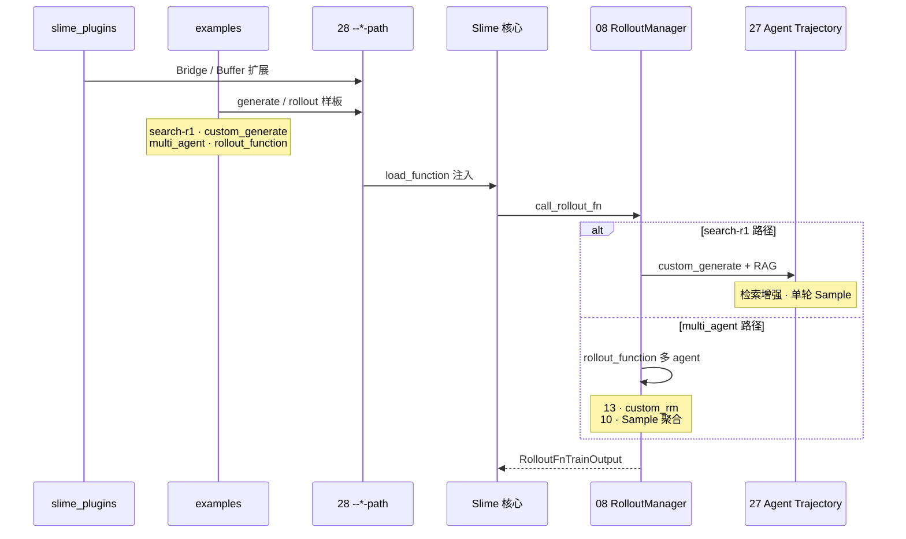

# 阶段 VII · 扩展与生态（Plugins · Examples）

> **你只需阅读本目录，不必打开 `slime/` 源码。**
> 内嵌代码对应 slime Git commit `22cdc6e1`。
> 前置：[[28-Customization-00-MOC]]（17 类 `--*-path` 接口）。

---

## 本阶段解决什么问题

阶段 VI 讲清了「扩展接口如何挂载」。阶段 VII 回答：**`slime_plugins/` 与 `examples/` 如何分工？search-r1（custom_generate）与 multi_agent（rollout_function）等样板工程具体接在哪一层？**

一个专题覆盖生态扩展全链路：

| 模块 | 角色 | 一句话 |
|------|------|--------|
| [[29-Plugins-Examples-00-MOC|29 Plugins-Examples]] | 插件与样板 | slime_plugins Bridge/Buffer、examples 可运行 RL 工作流 |

---

## 端到端时序（阶段 VII 验收图）

满足阶段 VII 验收：「能对比 search-r1 与 multi_agent 的接入点与 `--*-path` 组合」。

**Explain：** `slime/` 核心是闭环；**slime_plugins/** 放可选模型 Bridge 与算子；**examples/** 放端到端可运行样板。二者都通过 28 定义的 `--*-path` 接入，不改核心 train 循环。

---

## 零基础一句话

**像「官方 SDK + 示例 App Store」：** slime_plugins 是可选配件库，examples 是完整 Demo（搜题 R1、多 Agent 协作），28 的 CLI 插槽是 USB 口——插上就能跑。

---

## 推荐阅读顺序

读完 [[28-Customization-00-MOC]] 后，按以下顺序深入本阶段唯一专题：

| 顺序 | 文档 | 必读理由 |
|------|------|----------|
| 1 | [[29-Plugins-Examples-01-核心概念|29/01-核心概念]] | plugins vs examples 分工 |
| 2 | [[29-Plugins-Examples-02-源码走读|29/02-源码走读]] | search-r1 与 multi_agent 目录结构 |
| 3 | [[29-Plugins-Examples-03-数据流与交互|29/03-数据流与交互]] | custom_generate vs rollout_function 接入层 |
| 4 | [[29-Plugins-Examples-04-关键问题|29/04-关键问题]] | 选型：何时 fork example vs 写 plugin |
| 5 | [[29-Plugins-Examples-05-checkpoint|29/05-checkpoint]] | 阶段验收清单 |

---

## 阶段衔接

| 方向 | 模块 | 衔接点 |
|------|------|--------|
| ← 上一阶段 | 27–28 高级特性 | `--*-path` 接口 → plugins/examples 实现 |
| → 总结复盘 | 90 总结复盘 | 全链路回顾与 cross-library 对照 |
| → Rollout | 12–14 | rollout_function / alt rollout 替换点 |
| → Agent | 27 Agent-Trajectory | search-r1 等多轮 generate 样板 |
| → 双库 | [[91_dashboard/cross-library-map]] | Slime rollout ↔ SGLang serving 对照 |

---

## 验证建议（零基础可试）

1. **接入点对比：** 对照 [[29-Plugins-Examples-03-数据流与交互]]，说明 search-r1 走 `--custom-generate-function-path` 而 multi_agent 走 `--rollout-function-path` 的原因。
2. **目录浏览：** 在笔记 [[29-Plugins-Examples-02-源码走读]] 中定位 `examples/search-r1/run.sh` 与 `examples/multi_agent/run.sh` 的 CLI 差异。
3. **plugin 边界：** 列举 slime_plugins 中一项 Bridge 扩展及其对应的 Megatron/SGLang 对接点（见 [[29-Plugins-Examples-01-核心概念]]）。

---

## 模块导航

| 模块 | 目录 | 状态 |
|------|------|------|
| 29 | [[29-Plugins-Examples-00-MOC|Plugins-Examples]] | ✅ |

← [[06-高级特性-00-MOC|高级特性]] · → [[Slime-90-总结复盘-00-MOC|总结复盘]]
