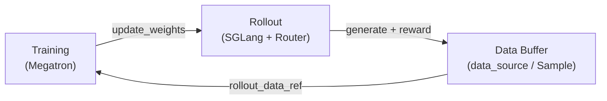

# Slime 源码 30 批次渐进式阅读计划

> **派 Agent 执行：** 逐批细节见 [[AGENT-DISPATCH]]（源码范围、走读顺序、验收标准、Prompt 模板）。  
> 本文是总体规划与写作规范；**不要跳过 AGENT-DISPATCH 直接写笔记。**

> 目标：在 `slime_reading/` 目录中逐步建立**自包含**的中文源码讲解体系——读者**只读 slime_reading，不读 slime**。  
> 方法：每批次聚焦一个可验收子系统，产出「讲解 + 内嵌源码」交织的文档，并同步更新知识图谱。

> **与 SGLang 阅读的关系：** Slime 以 Megatron 训练 + SGLang Rollout 为核心。SGLang 推理内核细节见 [[SGLang源码阅读指南]]；本计划聚焦 **RL 后训练数据流**（generate → train → update_weights 闭环）。

---

## 〇、合规性说明

### 读者自包含要求

| 检查项 | 要求 |
|--------|------|
| 读者是否需要打开 `slime/` | ✅ **不需要**；源码内嵌在 slime_reading 文档中 |
| 源码呈现方式 | ✅ **内嵌完整代码块** + 路径/行号标注 + 中文逐段讲解 |
| 概念/数据流文档是否含代码 | ✅ **所有 5 个标准文档**均须含内嵌源码 |
| 自包含验收 | ✅ checkpoint 含「不打开 slime 能读懂本模块」 |

### Skills 合规（understand-anything 系列）

| Skill | 要求 | 本计划如何满足 |
|-------|------|----------------|
| `/understand` | 生成 `knowledge-graph.json` | 批次 0（前置）+ 每 5 批增量更新 |
| `/understand-explain` | 角色、结构、连接、数据流 | 映射到每批 `01`–`04` 固定章节 |
| `/understand-onboard` | 总览、架构层、导览、文件地图 | **批次 30** 产出索引六件套 |
| `/understand-domain` | 业务域流程图 | 每 5 批更新；**批次 30** 写入 `Slime-业务域流程.md` |
| 语言 | `--language zh` | 全部 slime_reading 文档使用中文 |

**前置条件：** 开始批次 01 写作前，对 `slime/` 运行一次 `/understand --language zh`。图谱是**写作侧**工具。

**知识图谱路径：** `F:\源码阅读\slime\.understand-anything\knowledge-graph.json`

**内嵌代码基线：** slime commit `22cdc6e1`

---

## 一、总体架构（30 批分 8 阶段）

> 逐批目录、源码文件、函数级走读顺序见 [[AGENT-DISPATCH]] §二–§三。

```mermaid
flowchart TB
    subgraph P0["阶段 0：地基（批 01）"]
        B1[项目总览与方法论]
    end

    subgraph P1["阶段 I：启动与入口（批 02–04）"]
        B2[训练主循环]
        B3[参数与配置]
        B4[工具链与数据准备]
    end

    subgraph P2["阶段 II：Ray 编排（批 05–06）"]
        B5[Placement Group]
        B6[TrainRayActor]
    end

    subgraph P3["阶段 III：Rollout 生成（批 07–11）"]
        B7[RolloutManager]
        B8[SGLang Engine]
        B9[Rollout 核心]
        B10[DataSource]
        B11[RM Hub]
    end

    subgraph P4["阶段 IV：训练后端（批 12–15）"]
        B12[Megatron Actor]
        B13[Model 与前向]
        B14[Loss 与 RL]
        B15[训练数据管线]
    end

    subgraph P5["阶段 V：权重同步（批 16–19）"]
        B16[UpdateWeight 总览]
        B17[Megatron→HF]
        B18[多路径同步]
        B19[Checkpoint 与 Offload]
    end

    subgraph P6["阶段 VI：高级特性（批 20–24）"]
        B20[异步训练]
        B21[OPD]
        B22[Agent]
        B23[Filter Hub]
        B24[PD 分离与 SGLang Config]
    end

    subgraph P7["阶段 VII：扩展（批 25–26）"]
        B25[slime_plugins]
        B26[Examples 生态]
    end

    subgraph P8["阶段 VIII：收官（批 27）"]
        B27[全链路复盘]
    end

    P0 --> P1 --> P2 --> P3 --> P4 --> P5 --> P6 --> P7 --> P8
```



### Slime 核心三角（贯穿全计划）



---

## 二、每批次标准交付物

每完成一批，必须在对应目录下产出。**五篇正文均须内嵌源码**。

| 文件 | 内容 | 内嵌源码要求 |
|------|------|--------------|
| `{模块名}-00-MOC.md` | 概述、目标、衔接；含**本批最关键的一段入口代码** | ≥ 1 段（10–30 行） |
| `{模块名}-01-核心概念.md` | 术语、设计动机、架构位置 | ≥ 2 段示例代码 |
| `{模块名}-02-源码走读.md` | 按调用顺序精读（**主文档**） | ≥ 8 段，覆盖本批全部关键函数/类 |
| `{模块名}-03-数据流与交互.md` | IO、消息、上下游 | ≥ 3 段（数据结构 + 调用处） |
| `{模块名}-04-关键问题.md` | FAQ、易错点、对比 | ≥ 2 段（易错 vs 正确写法） |
| `{模块名}-05-checkpoint.md` | 验收清单 | — |

**每批内嵌源码总量下限：≥ 15 段代码块，合计 ≥ 200 行**（RolloutManager、Megatron Actor 等核心模块可至 400+ 行）。

**checkpoint 模板：**

```markdown
- [ ] 不打开 slime/ 目录，仅读本批 slime_reading 文档，能说明本模块职责
- [ ] 能画出本模块在 RL 闭环（generate → train → update_weights）中的位置
- [ ] 能说出 3 个核心类/函数及其职责（文档中均有对应内嵌代码）
- [ ] 能追踪一条典型 rollout step 经过本模块的完整路径
- [ ] 五篇正文合计 ≥ 15 段内嵌源码，且每段后有中文讲解
- [ ] 已更新 Slime-progress.md 与本批状态
```

**图谱更新节点（每 5 批）：** 批次 5、10、15、20、25、27 完成后增量更新 `/understand` 图谱。

---

## 三、批次详细计划

### 阶段 0：地基 —— 理解 Slime 是什么（批 01）

| 批 | 主题 | 源码范围 | 产出目录 | 预估工时 |
|----|------|----------|----------|----------|
| **01** | 项目总览与阅读方法论 | `README.md`, `README_zh.md`, `setup.py`, `requirements.txt`, `imgs/arch.png` 对应说明 | `slime_reading/00-方法论/` | 2h |

**阶段 0 结束验收：** 能口述 Slime 与 vLLM-RL / OpenRLHF / verl 等框架的设计差异（Megatron+SGLang 原生透传、Data Buffer 统一数据流）。

**前置知识：** 建议已读 [[SGLang源码阅读指南]] 批次 01–07（启动 + Scheduler 概览），理解 SGLang 作为 Rollout 引擎的角色。

---

### 阶段 I：启动与入口 —— 从 `train.py` 到参数体系（批 02–04）

| 批 | 主题 | 源码范围 | 产出目录 | 预估工时 |
|----|------|----------|----------|----------|
| **02** | 训练主循环 | `train.py`, `train_async.py`, `slime/utils/misc.py` (`should_run_periodic_action`) | `slime_reading/01-启动与入口/02-训练主循环/` | 4h |
| **03** | 参数与配置体系 | `slime/utils/arguments.py`, `slime/backends/sglang_utils/arguments.py`, `slime/backends/megatron_utils/arguments.py`, `docs/en/get_started/usage.md` | `slime_reading/01-启动与入口/03-Arguments/` | 5h |
| **04** | 工具链与数据准备 | `tools/convert_hf_to_torch_dist.py`, `tools/convert_torch_dist_to_hf.py`, `scripts/models/*.sh`, `docs/en/get_started/quick_start.md` | `slime_reading/01-启动与入口/04-Tools-DataPrep/` | 3h |

**阶段 I 结束验收：** 能画出 `parse_args()` → `create_placement_groups()` → `create_rollout_manager()` → `create_training_models()` → `for rollout_id: generate → train → update_weights` 的调用栈。

---

### 阶段 II：Ray 编排 —— GPU 资源与 Actor 拓扑（批 05–06）

| 批 | 主题 | 源码范围 | 产出目录 | 预估工时 |
|----|------|----------|----------|----------|
| **05** | Placement Group 与资源分配 | `slime/ray/placement_group.py`, `slime/ray/utils.py`, colocate/offload 相关参数 | `slime_reading/02-Ray编排/05-PlacementGroup/` | 4h |
| **06** | TrainRayActor 与 ActorGroup | `slime/ray/train_actor.py`, `slime/ray/actor_group.py`, `slime/ray/ray_actor.py` | `slime_reading/02-Ray编排/06-TrainActor/` | 4h |

**阶段 II 结束验收：** 能解释 `--colocate` / `--offload` / `--offload-rollout` / `--offload-train` 四种模式下 GPU 如何分时复用。

---

### 阶段 III：Rollout 生成 —— SGLang 推理 + 数据产出（批 07–11）

| 批 | 主题 | 源码范围 | 产出目录 | 预估工时 |
|----|------|----------|----------|----------|
| **07** | RolloutManager 核心 | `slime/ray/rollout.py`, `slime/ray/rollout_validation.py` | `slime_reading/03-Rollout生成/07-RolloutManager/` | 6h |
| **08** | SGLang Engine 集成 | `slime/backends/sglang_utils/sglang_engine.py`, `server_control.py`, `external.py` | `slime_reading/03-Rollout生成/08-SGLang-Engine/` | 5h |
| **09** | Rollout 核心逻辑 | `slime/rollout/sglang_rollout.py`, `sglang_streaming_rollout.py`, `base_types.py`, `call_rollout_fn` | `slime_reading/03-Rollout生成/09-Rollout-Core/` | 5h |
| **10** | DataSource 与 Sample 类型 | `slime/rollout/data_source.py`, `slime/utils/types.py`, `slime/utils/data.py` | `slime_reading/03-Rollout生成/10-DataSource/` | 4h |
| **11** | Reward Model Hub | `slime/rollout/rm_hub/`, `docs/en/get_started/customization.md` 奖励相关节 | `slime_reading/03-Rollout生成/11-RM-Hub/` | 3h |

**阶段 III 结束验收：** 能追踪一条 prompt 从 `data_source` → `SGLangEngine.generate` → `Sample` → `rollout_data` tensor 化的完整路径；能说明 `--custom-generate-function-path` 的挂载点。

---

### 阶段 IV：训练后端 —— Megatron Actor 与 RL Loss（批 12–15）

| 批 | 主题 | 源码范围 | 产出目录 | 预估工时 |
|----|------|----------|----------|----------|
| **12** | MegatronTrainRayActor | `slime/backends/megatron_utils/actor.py`, `initialize.py` | `slime_reading/04-训练后端/12-Megatron-Actor/` | 6h |
| **13** | Model 与前向 | `slime/backends/megatron_utils/model.py`, `model_provider.py`, `cp_utils.py` | `slime_reading/04-训练后端/13-Model/` | 5h |
| **14** | Loss 与 RL 算法 | `slime/backends/megatron_utils/loss.py`, `slime/utils/ppo_utils.py`, `routing_replay.py` | `slime_reading/04-训练后端/14-Loss-RL/` | 5h |
| **15** | 训练数据管线 | `slime/backends/megatron_utils/data.py`, `process_rollout_data`, `seqlen_balancing.py`, `dp_schedule.py` | `slime_reading/04-训练后端/15-Train-Data/` | 4h |

**阶段 IV 结束验收：** 能说明一次 `async_train(rollout_id, rollout_data_ref)` 从数据反序列化到 backward 的调用栈；能对比 GRPO / PPO / REINFORCE 在 `loss.py` 中的分支。

---

### 阶段 V：权重同步 —— 训练与推理的桥梁（批 16–19）

| 批 | 主题 | 源码范围 | 产出目录 | 预估工时 |
|----|------|----------|----------|----------|
| **16** | UpdateWeight 总览 | `slime/backends/megatron_utils/update_weight/`, `actor.update_weights()` | `slime_reading/05-权重同步/16-UpdateWeight/` | 5h |
| **17** | Megatron→HF 转换 | `slime/backends/megatron_utils/megatron_to_hf/`, `hf_checkpoint_saver.py` | `slime_reading/05-权重同步/17-Megatron-to-HF/` | 4h |
| **18** | 多路径同步实现 | `update_weight_from_tensor.py`, `update_weight_from_disk.py`, `update_weight_from_distributed.py`, `update_weight_from_disk_delta.py`, `docs/en/advanced/delta-weight-sync.md` | `slime_reading/05-权重同步/18-Sync-Paths/` | 5h |
| **19** | Checkpoint 与 Offload | `checkpoint.py`, `memory_utils.py`, `reloadable_process_group.py`, `torch_memory_saver` 交互 | `slime_reading/05-权重同步/19-Checkpoint-Offload/` | 4h |

**阶段 V 结束验收：** 能对比 tensor / disk / distributed / delta 四种权重同步路径的适用场景与 `--check-weight-update-equal` 校验机制。

---

### 阶段 VI：高级特性 —— 生产级 RL 能力（批 20–24）

> **维护者注意：** 下表为早期规划草案，批次编号已与终版不一致。以 `90_meta/slime-module-dir-map.md`、[[AGENT-DISPATCH]]、`Slime-progress.md` 为准（async/OPD→批 14；Agent→27；filter→13+28；CP→23；PD→09+16）。

| 批 | 主题 | 源码范围 | 产出目录 | 预估工时 |
|----|------|----------|----------|----------|
| **20** | 异步训练 | `train_async.py`, `slime/rollout/fully_async_rollout.py`, `examples/fully_async/` | `slime_reading/06-高级特性/20-Async-Training/` | 4h |
| **21** | On-Policy Distillation | `slime/rollout/on_policy_distillation.py`, `docs/en/advanced/on-policy-distillation.md`, `examples/on_policy_distillation/` | `slime_reading/06-高级特性/21-OPD/` | 4h |
| **22** | Agent 框架 | `slime/agent/`, `docs/en/get_started/agent.md`, `examples/coding_agent_rl/`, `examples/multi_agent/` | `slime_reading/06-高级特性/22-Agent/` | 5h |
| **23** | Filter Hub 与动态采样 | `slime/rollout/filter_hub/`, `sleep_rollout.py`, `sft_rollout.py` | `slime_reading/06-高级特性/23-FilterHub/` | 3h |
| **24** | PD 分离与 SGLang Config | `slime/backends/sglang_utils/sglang_config.py`, `docs/en/advanced/pd-disaggregation.md`, `docs/en/advanced/sglang-config.md`, `docs/en/advanced/external-rollout-engines.md` | `slime_reading/06-高级特性/24-PD-SGLangConfig/` | 5h |

**阶段 VI 结束验收：** 能对比 sync / async / fully-async 三种训练模式的 rollout 重叠策略；能说明 Agent 工作流如何通过 `--custom-generate-function-path` 接入而不 fork 训练内核。

---

### 阶段 VII：扩展与生态（批 25–26）

| 批 | 主题 | 源码范围 | 产出目录 | 预估工时 |
|----|------|----------|----------|----------|
| **25** | slime_plugins | `slime_plugins/models/`, `mbridge/`, `megatron_bridge/`, `rollout_buffer/` | `slime_reading/07-扩展与生态/25-slime_plugins/` | 5h |
| **26** | Examples 生态 | `examples/search-r1/`, `geo3k_vlm*/`, `tau-bench/`, `retool/`, `eval_multi_task/`, `delta_weight_sync/` | `slime_reading/07-扩展与生态/26-Examples/` | 4h |

**阶段 VII 结束验收：** 能说明 slime_plugins 与核心 `slime/` 的分工边界；能选一个 example 画出其 custom generate 函数如何挂入标准 RL 循环。

---

### 阶段 VIII：收官（批 27）

| 批 | 主题 | 源码范围 | 产出目录 | 预估工时 |
|----|------|----------|----------|----------|
| **27** | 全链路复盘与索引 | 回顾批 01–26，整合 `.understand-anything/` 图谱 | `slime_reading/08-总结与索引/` | 6h |

**批次 27 额外交付（对齐 understand-onboard + understand-domain）：**

| 文件 | 对应 Skill | 说明 |
|------|-----------|------|
| `08-总结与索引-01-项目总览.md` | understand-onboard § Overview | 含 setup/train 等关键入口代码 |
| `08-总结与索引-02-架构分层.md` | understand-onboard § Layers | Training / Rollout / Data Buffer 三层 |
| `08-总结与索引-03-关键概念.md` | understand-onboard § Key Concepts | rollout_id、Sample、update_weights 等 |
| `08-总结与索引-04-导读路径.md` | understand tour | 每步含核心代码内嵌 |
| `08-总结与索引-05-文件地图.md` | understand-onboard § File Map | slime/ 顶层文件职责 |
| `08-总结与索引-06-复杂度热点.md` | understand-onboard § Hotspots | rollout.py、actor.py、loss.py |
| `全链路RL训练追踪.md` | — | generate → train → update_weights 每跳内嵌代码 |
| `Slime-模块依赖图.md` | understand layers/edges | Mermaid + 关键 import |
| `Slime-术语表.md` | — | RL 后训练术语 + 代码片段 |
| `Slime-业务域流程.md` | understand-domain | GRPO/PPO/SFT/Agentic RL 流程 |
| `与SGLang阅读对照.md` | — | slime 模块 ↔ sglang_reading 批次映射 |

---

## 四、执行节奏建议

| 节奏 | 说明 |
|------|------|
| **每周 2 批** | 约 14 周完成，适合业余精读 |
| **每周 3 批** | 约 9 周完成，适合全职阅读 |
| **每 5 批复盘** | 运行 `/understand --language zh` 增量更新知识图谱 |
| **每 10 批大复盘** | 重读各批 `checkpoint.md`，修正前后矛盾 |

---

## 五、Skills 工作流（写作侧，每批必做）

```text
0. （前置）/understand --language zh [slime/]  → 生成知识图谱
1. /understand-explain <关键文件>               → 产出讲解草稿
2. 从 slime 提取源码 → 内嵌到 slime_reading 五篇正文
3. /understand-domain（每 5 批）                → 业务域流程
4. 对照图谱 layers/tour 检查本批是否遗漏关键节点
5. 填写 checkpoint.md → 自测 → 更新 Slime-progress.md
```

---

## 六、文档写作规范（slime_reading 自包含）

### 6.1 ETC 三段式（强制）

1. **Explain** — 用中文说明「这段代码要解决什么问题」
2. **Code** — 内嵌源码（见 6.2）
3. **Comment** — 逐行或逐块解释；标注与上下游的交互

### 6.2 内嵌代码块格式

```markdown
```python
# 来源：train.py L9-L27
def train(args):
    configure_logger()
    pgs = create_placement_groups(args)
    ...
```
```

- 第一行注释：**来源路径 + 行号**
- 可选第二行：`# 提交版本：22cdc6e1`
- 过长时用 `# ... 省略 ...`，但**关键分支必须保留**

### 6.3 Obsidian 命名与 tags

| 规则 | 值 |
|------|-----|
| 文件名 | `{模块名}-{NN}-{文档类型}.md` |
| batch tag | `slime/batch/NN` |
| doc_type tag | `slime/doc/moc` · `concept` · `walkthrough` · `dataflow` · `faq` · `checkpoint` |
| 双链 | `[[07-RolloutManager-01-核心概念]]` |
| Mermaid 换行 | `<br/>`，禁止 `\n` |

完整语法见 [[90_meta/obsidian-syntax-rules]]（tag 前缀将扩展 `slime/` 系列）。

### 6.4 与 `/understand-explain` 的章节映射

| understand-explain 维度 | slime_reading 文档位置 |
|------------------------|------------------------|
| 架构角色 | `01-核心概念.md` § 架构位置 |
| 内部结构 | `02-源码走读.md` 全文 |
| 外部连接 | `03-数据流与交互.md` § 上下游 |
| 数据流 | `03-数据流与交互.md` § 数据流 |
| 模式/复杂度 | `04-关键问题.md` |

---

## 七、优先级与可裁剪说明

### 不可跳过（掌握 RL 主链路）

**01, 02, 05, 07, 08, 10, 12, 14, 16, 27**

### 可延后（扩展 / 专用场景）

**17**（Megatron→HF 细节）、**25–26**（plugins / examples）、**24**（PD 分离，需 SGLang PD 前置知识）

### 与 SGLang 阅读的交叉引用

| Slime 批次 | 建议先读的 SGLang 批次 |
|-----------|----------------------|
| 08 SGLang Engine | [[03-HTTP-Server-00-MOC]]、[[07-Scheduler-00-MOC]] |
| 24 PD / SGLang Config | [[22-Disaggregation-00-MOC]]、[[23-Distributed-00-MOC]] |
| 权重同步（16–18） | [[12-ModelLoader-00-MOC]]、[[32-CheckpointEngine-00-MOC]] |

---

## 八、下一步

从 **[[Slime-00-方法论-00-MOC|批次 01]]** 开始。完成每批后更新 [[Slime-progress]]。
